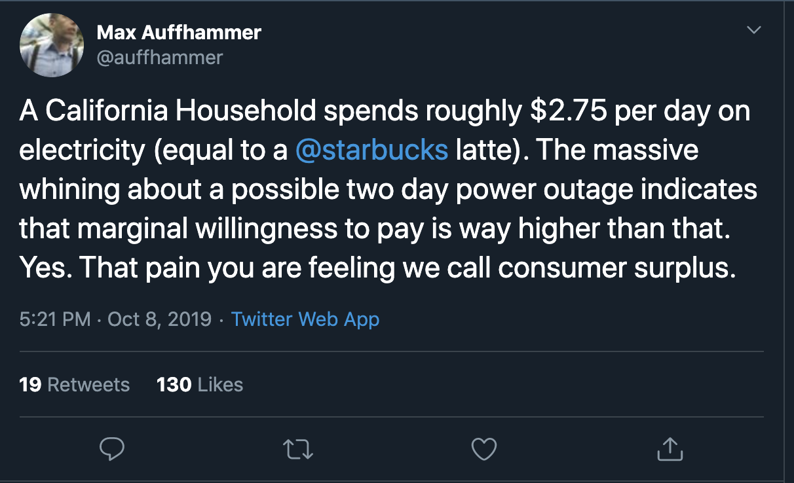

class: inverse, center, middle

```{R, setup, include = F}
options(htmltools.dir.version = FALSE)
library(pacman)
p_load(
  broom, here, tidyverse,
  latex2exp, ggplot2, ggthemes, viridis, extrafont, gridExtra,
  kableExtra,
  dplyr, magrittr, knitr, parallel, tufte,emo, ggrepel, sf, hrbrthemes, lwgeom, maps, mapdata, spData,leaflet
)
# Define pink color
red_pink <- "#e64173"
turquoise <- "#20B2AA"
grey_light <- "grey70"
grey_mid <- "grey50"
grey_dark <- "grey20"
# Dark slate grey: #314f4f
# Knitr options
opts_chunk$set(
  comment = "#>",
  fig.align = "center",
  fig.height = 7,
  fig.width = 10.5,
  warning = F,
  message = F
)
options(device = function(file, width, height) {
  svg(tempfile(), width = width, height = height)
})
# A blank theme for ggplot
theme_empty <- theme_bw() + theme(
  line = element_blank(),
  rect = element_blank(),
  strip.text = element_blank(),
  axis.text = element_blank(),
  plot.title = element_blank(),
  axis.title = element_blank(),
  plot.margin = structure(c(0, 0, -0.5, -1), unit = "lines", valid.unit = 3L, class = "unit"),
  legend.position = "none"
)
theme_simple <- theme_bw() + theme(
  line = element_blank(),
  panel.grid = element_blank(),
  rect = element_blank(),
  strip.text = element_blank(),
  axis.text.x = element_text(size = 18, family = "STIXGeneral"),
  axis.text.y = element_blank(),
  axis.ticks = element_blank(),
  plot.title = element_blank(),
  axis.title = element_blank(),
  # plot.margin = structure(c(0, 0, -1, -1), unit = "lines", valid.unit = 3L, class = "unit"),
  legend.position = "none"
)
theme_axes_math <- theme_void() + theme(
  text = element_text(family = "MathJax_Math"),
  axis.title = element_text(size = 22),
  axis.title.x = element_text(hjust = .95, margin = margin(0.15, 0, 0, 0, unit = "lines")),
  axis.title.y = element_text(vjust = .95, margin = margin(0, 0.15, 0, 0, unit = "lines")),
  axis.line = element_line(
    color = "grey70",
    size = 0.25,
    arrow = arrow(angle = 30, length = unit(0.15, "inches")
  )),
  plot.margin = structure(c(1, 0, 1, 0), unit = "lines", valid.unit = 3L, class = "unit"),
  legend.position = "none"
)
theme_axes_serif <- theme_void() + theme(
  text = element_text(family = "MathJax_Main"),
  axis.title = element_text(size = 22),
  axis.title.x = element_text(hjust = .95, margin = margin(0.15, 0, 0, 0, unit = "lines")),
  axis.title.y = element_text(vjust = .95, margin = margin(0, 0.15, 0, 0, unit = "lines")),
  axis.line = element_line(
    color = "grey70",
    size = 0.25,
    arrow = arrow(angle = 30, length = unit(0.15, "inches")
  )),
  plot.margin = structure(c(1, 0, 1, 0), unit = "lines", valid.unit = 3L, class = "unit"),
  legend.position = "none"
)
theme_axes <- theme_void() + theme(
  text = element_text(family = "Fira Sans Book"),
  axis.title = element_text(size = 18),
  axis.title.x = element_text(hjust = .95, margin = margin(0.15, 0, 0, 0, unit = "lines")),
  axis.title.y = element_text(vjust = .95, margin = margin(0, 0.15, 0, 0, unit = "lines")),
  axis.line = element_line(
    color = grey_light,
    size = 0.25,
    arrow = arrow(angle = 30, length = unit(0.15, "inches")
  )),
  plot.margin = structure(c(1, 0, 1, 0), unit = "lines", valid.unit = 3L, class = "unit"),
  legend.position = "none"
)

```


# Lecture II: Review & The 5 Axioms of Urban Economics

---


name: schedule

# Schedule

## Today

--

1) .hi.purple[EC201 Review]

2) .hi.purple[5 Axioms of Urban Economics]


--

--

## Upcoming

  - .hi.slate[EC201 Review Quiz on Canvas]
  
  - .hi.slate[Letter of Intro on Canvas]
  
  - .hi.slate[Reading] (intro & chapter I of _ToTC_)

--

---

name: ec201_review
# EC201 Quiz

- The quiz will open .hi[tonight at 8PM] and is due .hi[Monday the 13th] @ Midnight

- __90 Minute__ Time limit, and __one__ attempt. It should take you _well_ under 90 minutes


- Worth 4% of your final grade


---


#EC201 Quiz


##.hi.orange[Format]

- .hi[5 Questions] worth .hi.purple[4 points each]

  - 2 Multiple Choice

  - 3 Calculations


--

## .hi.orange[Topics]:

  - Graph Supply and Demand. Compute Equilibrium
  
  - Compute Consumer and Producer Surplus
  
  - Elasticities (interpretation)
  
  - Profit, cost, revenue


---

name:supply_demand
# Supply & Demand

We will start with .hi.purple[supply] & .hi[demand]:

--


  - .hi.slate[Supply curves] are constructed from .hi.purple[firms] making the best production decisions they can

--
  
  - .hi.slate[Demand curves] are constructed from .hi[consumers] making optimal purchase decisions
  
--
  
--

The key players in *the* market are:

  - .hi.purple[firms] (generating supply)
  
  - .hi[consumers] (generating demand)
  
  
--

.hi.slate[Fundamental Assumptions]: Marginal value (utility) is decreasing and marginal cost is increasing


---


#EC201: Supply & Demand

##Related Definitions

- .hi.slate[Equilibrium]: A pair of points $(Q^\star, P^\star)$ such that there is no excess supply or demand
  
  - In other words, equilibrium is when Supply = Demand
  
--

- .hi.slate[Consumer Surplus]: The .hi[difference] between the price consumers _actually_ pay and their __maximum__ willingness to pay (WTP)

--

- .hi.slate[Producer Surplus]: The .hi.purple[difference] between the price producers _actually_ sell their good for and their __minimum__ willingness to sell

--

--
---


# An Example


```{R, chetty, out.width = "100%", echo = F}

```


Source: [@auffhammer](https://twitter.com/auffhammer)

---


#EC201: Market Equilibrium Computation


.hi.slate[Example]

Suppose we are given the following:

- Supply: $\color{#e64173} {P(Q_s) = 10 + Q_s}$

- Demand: $\color{#6A5ACD} {P(Q_d)  = 20 - 4*Q_d}$

--

##Tasks 


1. Carefully graph and label both curves

1. Compute the Equilibrium

1. Compute Consumer and Producer Surplus

--


---


#EC201: Example

```{R, supply_demand, echo=F,fig.height = 5, fig.width = 8, dev = "svg", cache=T}
#supply and demand example
supply_one <- function(x) 10+ x
demand_one <- function(x) 20 - 4*x

#create supply and demand graph
ggplot(data.frame(x=c(0, 10)), aes(x)) + 
  stat_function(fun=supply_one, col = red_pink)+
  stat_function(fun = demand_one, col = "purple")+
  geom_vline(xintercept =0, size = 0.5)+
  geom_hline(yintercept =0, size = 0.5)+
  geom_segment(x = 2, xend=2, y=0, yend=12, linetype = "dashed")+
  geom_segment(x = 0, xend=2, y=12, yend=12, linetype = "dashed")+
  geom_text(aes(x=2.4, label= "(2,12)", y=11.9))+
  geom_text(aes(x = .5, y= 13, label = "CS"))+
  geom_text(aes(x = .5, y=11, label = "PS"))+
  ggthemes::theme_pander()+
  ylim(0,20)+
  xlim(0,7)+
  labs(x = "Quantity", y= "Price")


```


---


#Calculation

- .hi.slate[Equilibrium]:

\begin{align*}
10 + Q^\star &= 20 - 4*Q^\star\\
5Q^\star &= 10\\
Q^\star &= 2
\end{align*}

Plug this into either supply or demand equation to get:

\begin{align*}
P^\star = 10 + 2 = 12
\end{align*}


- .hi.slate[Consumer Surplus]: 

  - $CS= \frac{1}{2}*(20-12)*(2-0) = 8$

- .hi.slate[Producer Surplus]: 

  - $PS = \frac{1}{2}*(12-2)(2-0) = 2$


---

name:elasticites
#EC201: Elasticities

In general, elasticities measure responsiveness of one variable to another, __in percentage terms__

.hi.slate[Common elasticities]


--

- .hi[Own Price Elasticity (good x)]: Measures how much quantity demanded for __x__ will respond to a one percent change in the price of good __x__
  
    - Formula: $\varepsilon_{x, P_x} = \frac{\%\Delta Q_x}{\%\Delta P_x}$
--

- .hi[Cross Price Elasticity (goods x,y)]: Measures how much quantity demanded for __x__ will respond to a one percent change in the price of .hi.purple[y]
    
    - Formula: $\varepsilon_{x,P_y} = \frac{\%\Delta Q_x}{\%\Delta P_y}$

--

--


---


#Elasticities: Interpretations

Suppose $\varepsilon_{x, P_x}= -0.5$. What does this mean in words? .hi.purple[Discuss]


--

A 1% change in the .hi[price of good x] will lead to a .5% change in the _opposite_ direction in the .hi[quantity demanded for good x]

--

The equation can be helpful. If $\varepsilon_{x, P_x}= -0.5$, then:

\begin{align*}
\frac{\%\Delta Q_x}{\%\Delta P_x}&= -0.5\\
\%\Delta Q_x &= -0.5 * \%\Delta P_x
\end{align*}


---


exclude: true
# Questions


__Review Questions__:


- If $\varepsilon_{x,y}>0$, are these goods complements or substitutes?

  - Substitutes, because an increase in the price of $y$ __increases__ demand for $x$
  
  - Lame example: cheerios and other cereal
  

-  If $\varepsilon_{x,y}<0$, are these goods complements or substitutes?

  - Complements, because an increase in the price of $y$ __decreases__ demand for $x$
  
---


name:profit
#EC201: Cost & Production

##Definitions

- .hi.slate[Total Revenue (TR)]: Amount of money firm brings in from selling $Q$ units. 
  
    - $TR = P*Q$
--

- .hi.slate[Total Cost (TC)]: The cost of producing $Q$ units units

--

--

- .hi.slate[Average Cost (AC)] = $\frac{TC}{Q}$

--

- .hi.slate[Profit] (often denoted as $\pi$): $\pi = TR-TC$
  


---


#EC201: Cost & Production Ex

Suppose the price of the output good is $3$ dollars per unit. Suppose a firm's cost function is $TC(Q) = 1+Q$. If the firm produces 8 units of the good, calculate:


- $TR$

- $TC$

- $AC$

- Profit


---

#EC201: Cost & Production Ex

Suppose the price of the output good is $3$ dollars per unit. Suppose a firm's cost function is $TC(Q) = 1+Q$. If the firm produces 8 units of the good, calculate:


- $TR = 3*8 = 24$

- $TC = 1 + 8 = 9$

- $AC = \frac{9}{8}$ 

- Profit $= 24 - 9 = 15$


---


class: inverse, middle
# Checklist


1. .hi[EC201 Review]: `r emo::ji("check")`

  - Supply & Demand
  
  - Elasticities
  
  - Production & Cost

2. .hi.purple[5 Axioms of Urban Economics]

---

---


#Foundations

As discussed in [lecture 1](https://rawcdn.githack.com/johnmorehouse/EC330_UrbanEcon/7a8c47a98871c1b0777d7af3a2cd490cf1fd6c23/Slides/001-intro/lecture_one.pdf), we are after some big questions in this course

- It is useful to agree upon a few basics before moving onto more complicated problems

--

## The 5 Axioms

- 5 .hi[assumptions] that we will _take as given_ throughout the class

  - Some lectures will be focused on refining our understanding of these axioms

--

- Almost everything we learn here ties back to one or multiple of the 5 axioms

--

---


name:axiom_1
#Axiom 1

__Axiom 1__: _Prices adjust to acheive .hi[locational equilibrium]_ <sup>.hi[†]</sup>

--

  - .hi[Locational Equilibrium]: The balance that exists when there is no incentive for firms or households to move

--


.hi.slate[Examples]

--

- Rents .hi.orange[near] campus > rents .hi.purple[far] from campus

--

- Home prices .hi.orange[near] good schools > home prices .hi.purple[near] bad schools

--

--

- Wages (and or) Amenities in .hi.orange[high] cost cities > Wages (and or) Amenities in .hi.purple[low] cost cities

--

--

.footnote[
.hi[†]: We will refine this definition later in the term
]
---

name:axiom_2
#Axiom 2

__Axiom 2__: _.hi[Self-reinforcing effects] generate extreme outcomes_


.hi[Self-reinforcing effect]: A pattern that leads to changes in the same direction

  - Also called a _positive feedback loop_
  


--

.hi.slate[Examples]

--

- Tech firms in the Silicon Valley

--

- Artists in Santa Fe, NM

--

Useful for explaining why it is common to have clustering of people and firms of similar types

---

name:axiom_3
#Axiom 3

__Axiom 3__ _.hi[Externalities] are Inefficient_

.hi[Externality]: A .hi.purple[cost] or .hi.orange[benefit] of a transaction experienced by somebody who is not involved in the transaction


--

.hi.purple[Negative Externalities] (costs)

  - Pollution
  
  - Noise 
  
  - Dilapidated housing

--


--

.hi.orange[Positive Externalities] (benefits)

  - Vaccines
  
  - Education

--

---


#Externalities part II

What do these have to do with .hi[efficiency]?<sup>.hi[†]</sup>

  - With any externality, private incentives are not aligned with social costs or benefits
  
--
  
  - .hi.slate[Example]: In the absence of quotas do people fish too much or too little?
  
--
    
--

      - Too much. This harms future fisheries
--

- Negative externalities are .hi.purple[overprovided] and positive externalities are .hi.orange[underprovided]
  
  - So a market with an externality is .hi[inefficient] 

.footnote[
.hi[†]: Highest total surplus
]

---

name:axiom_4
#Axiom 4

__Axiom 4__: _Production is subject to .hi[economies of scale]_

  - .hi[Economies of Scale]: When the average cost of production decreases as quantity produced increases
  
--


--


.hi.slate[Examples]


--

 - __Transportation__ of good & people
  
  - Trains shipping to small towns .hi.orange[vs] big cities
  
--

--

- __Education__
  
  - 20 person class .hi.orange[vs] 80 person class
  
--
 


---

name:axiom_5
#Axiom 5

__Axiom 5__: _Competition generates zero .hi[economic profit]_

--

- Degree of competition dictates .hi.purple[number of firms] in the market

- Firms enter (drives price down) until .hi[economic profit] is zero. That is, enough firms earn enough to stay in business but no more

--

- .hi[Economic Profit]: inclusive of .hi.purple[oppurtunity cost]

---


# List of the 5 Axioms

1. Prices adjust to acheive .hi[locational equilibrium]

2. .hi[Self-reinforcing effects] generate extreme outcomes

3. .hi[Externalities] are Inefficient

4. Production is subject to .hi[economies of scale]

5. Competition generates zero .hi[economic profit]


---


class: inverse, middle

# Checklist
1. .hi[EC201 Review]: `r emo::ji("check")`

  - Supply & Demand
  
  - Elasticities
  
  - Production & Cost

2. .hi[5 Axioms of Urban Economics]: `r emo::ji("check")`

---

---


#Planning


.hi[Next Class]:

- City Size


--

.hi[Due Soon]:

- Review Quiz (.hi.purple[Monday the 13th] @ Midnight)

- Letter of Intro (.hi.purple[Tuesday the 14th] @ Midnight)


--

---

#Table of Contents

.col-left[
###Econ 201 Review
.smallest[
1. [Supply & Demand](#supply_demand)
1. [Elasticities](#elasticities)
1. [Profit, Revenue, & Cost](#profit)
]
]

.col-right[
###5 Axioms of Urban Economics
.smallest[

1. [Axiom 1: Prices adjust to acheive locational equilibrium](#axiom_1)
1. [Axiom 2: Self-reinforcing effects generate extreme outcomes](#axiom_2)
1. [Axiom 3: Externalities are Inefficient](#axiom_3)
1. [Axiom 4: Production is subject to economies of scale](#axiom_4)
1. [Axiom 5: Competition generates zero economic profit](#axiom_5)


]
]


---


exclude:true


```{r decktape}
p_load(pagedown)
pagedown::chrome_print(here::here("002-review","lecture_two.html"))
```


<!-- --- -->
<!-- exclude: true -->

<!-- ```{R, generate pdfs, include = F} -->
<!-- system("decktape remark 02_goodsmarket_part1.html 02_goodsmarket_part1.pdf --chrome-arg=--allow-file-access-from-files") -->
<!-- ``` -->


