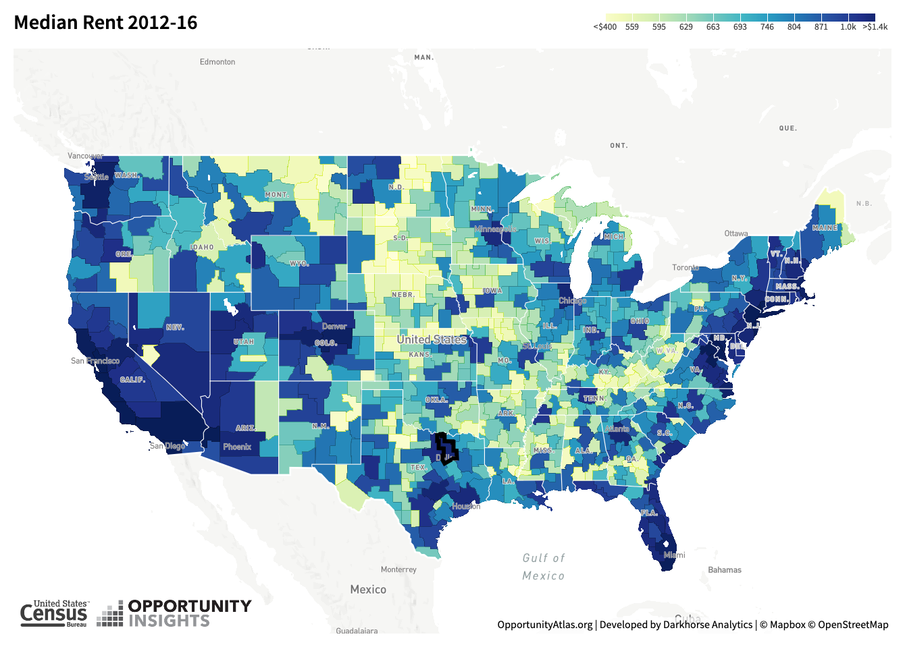
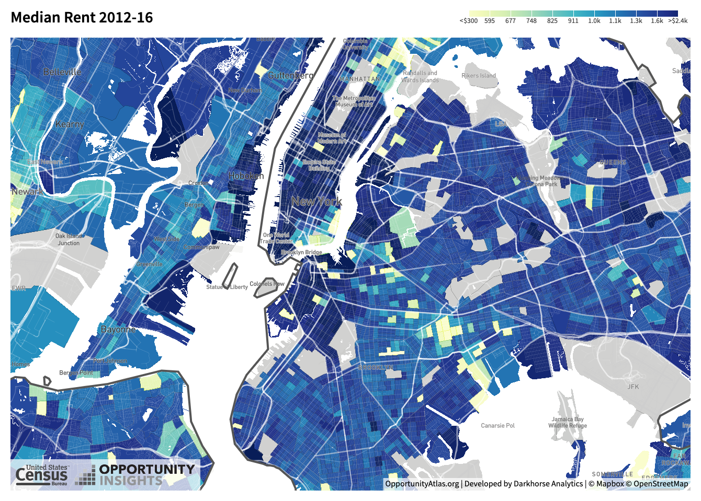
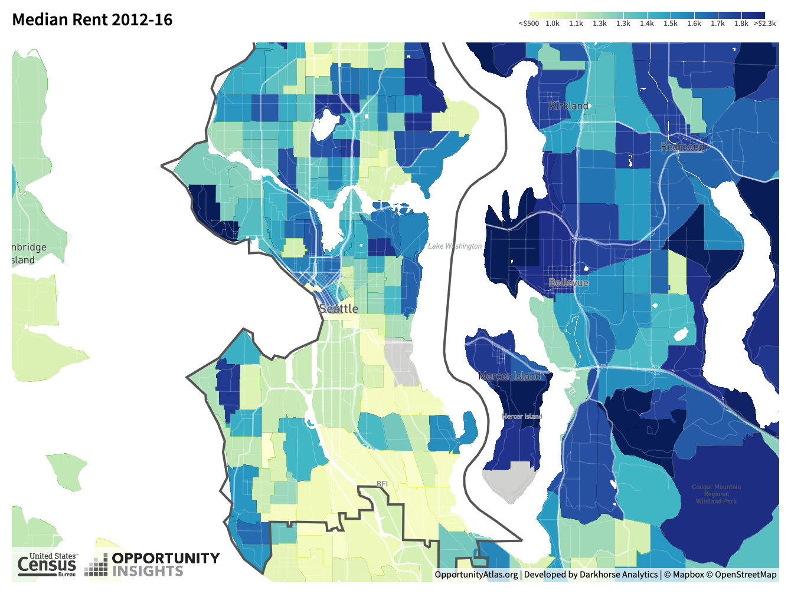
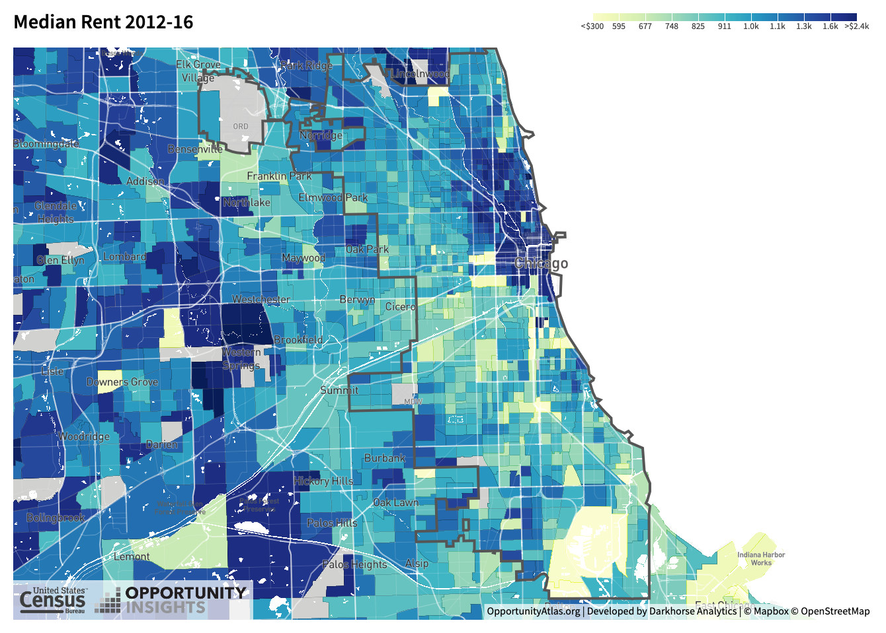

class: inverse, center, middle

```{R, setup, include = F}
options(htmltools.dir.version = FALSE)
library(pacman)
p_load(
  broom, here, tidyverse,
  latex2exp, ggplot2, ggthemes, viridis, extrafont, gridExtra,
  kableExtra,
  dplyr, magrittr, knitr, parallel, tufte,emo
)
# Define pink color
red_pink <- "#e64173"
turquoise <- "#20B2AA"
grey_light <- "grey70"
grey_mid <- "grey50"
grey_dark <- "grey20"
# Dark slate grey: #314f4f
# Knitr options
opts_chunk$set(
  comment = "#>",
  fig.align = "center",
  fig.height = 7,
  fig.width = 10.5,
  warning = F,
  message = F
)
opts_chunk$set(dev = "svg")
options(device = function(file, width, height) {
  svg(tempfile(), width = width, height = height)
})
# A blank theme for ggplot
theme_empty <- theme_bw() + theme(
  line = element_blank(),
  rect = element_blank(),
  strip.text = element_blank(),
  axis.text = element_blank(),
  plot.title = element_blank(),
  axis.title = element_blank(),
  plot.margin = structure(c(0, 0, -0.5, -1), unit = "lines", valid.unit = 3L, class = "unit"),
  legend.position = "none"
)
theme_simple <- theme_bw() + theme(
  line = element_blank(),
  panel.grid = element_blank(),
  rect = element_blank(),
  strip.text = element_blank(),
  axis.text.x = element_text(size = 18, family = "STIXGeneral"),
  axis.text.y = element_blank(),
  axis.ticks = element_blank(),
  plot.title = element_blank(),
  axis.title = element_blank(),
  # plot.margin = structure(c(0, 0, -1, -1), unit = "lines", valid.unit = 3L, class = "unit"),
  legend.position = "none"
)
theme_axes_math <- theme_void() + theme(
  text = element_text(family = "MathJax_Math"),
  axis.title = element_text(size = 22),
  axis.title.x = element_text(hjust = .95, margin = margin(0.15, 0, 0, 0, unit = "lines")),
  axis.title.y = element_text(vjust = .95, margin = margin(0, 0.15, 0, 0, unit = "lines")),
  axis.line = element_line(
    color = "grey70",
    size = 0.25,
    arrow = arrow(angle = 30, length = unit(0.15, "inches")
  )),
  plot.margin = structure(c(1, 0, 1, 0), unit = "lines", valid.unit = 3L, class = "unit"),
  legend.position = "none"
)
theme_axes_serif <- theme_void() + theme(
  text = element_text(family = "MathJax_Main"),
  axis.title = element_text(size = 22),
  axis.title.x = element_text(hjust = .95, margin = margin(0.15, 0, 0, 0, unit = "lines")),
  axis.title.y = element_text(vjust = .95, margin = margin(0, 0.15, 0, 0, unit = "lines")),
  axis.line = element_line(
    color = "grey70",
    size = 0.25,
    arrow = arrow(angle = 30, length = unit(0.15, "inches")
  )),
  plot.margin = structure(c(1, 0, 1, 0), unit = "lines", valid.unit = 3L, class = "unit"),
  legend.position = "none"
)
theme_axes <- theme_void() + theme(
  text = element_text(family = "Fira Sans Book"),
  axis.title = element_text(size = 18),
  axis.title.x = element_text(hjust = .95, margin = margin(0.15, 0, 0, 0, unit = "lines")),
  axis.title.y = element_text(vjust = .95, margin = margin(0, 0.15, 0, 0, unit = "lines")),
  axis.line = element_line(
    color = grey_light,
    size = 0.25,
    arrow = arrow(angle = 30, length = unit(0.15, "inches")
  )),
  plot.margin = structure(c(1, 0, 1, 0), unit = "lines", valid.unit = 3L, class = "unit"),
  legend.position = "none"
)

#get data---------------------------------------------------------------------
rent<-  tidycensus::get_acs(
  geography = "county", variables = "DP04_0134",
  state = c("WA", "OR", "CA"), geometry = TRUE
)


pop<-tidycensus::get_acs(
  geography = "county", variables = "B01003_001",
  state = c("WA", "OR", "CA"), geometry = TRUE
)

```


# Lecture V: Rents


---


name: schedule

# Schedule

## Today

--

1) .hi.purple[Intro to Rents]

2) .hi.purple[Rents] .hi.orange[Across] .hi.purple[Cities]

3) .hi.purple[Rents] .hi.orange[Within] .hi.purple[Cities]

--

--

## Upcoming

  - `r emo::ji("bangbang")` .hi.slate[HWI due] .hi[next class] (thurs, Jan 21)  `r emo::ji("bangbang")`
  
    - `r emo::ji("warning")` __No late homeworks will be accepted__ 

  - .hi.slate[Reading] (Chapter IV _ToTC_)
    
--

---


# Taking Stock

.hi.slate[First Two Weeks]: Intoduction and .hi.purple[existence, size & growth] (philosophical-ish questions)

--

.hi.slate[Now]: fundamentals of .pink[location choice theory]. .qa[Questions]

--

--

- Why do people choose to live in one place vs another? (SF vs Detroit)

  - .hi.slate[Today]: How do these choices impact rental prices (.pink[across cities])

--

- Conditional on choosing to live Eugene, will individuals .hi[systematically locate] in one neighborhood vs another?
 
  - .hi.slate[Today]: How do these choices impact rental prices (.purple[within city]) ?

--


.hi.slate[Later]: Formalize this. Learn __basics__ of [discrete choice modeling](https://en.wikipedia.org/wiki/Discrete_choice)


---


# Rents: An Overview


```{R, us, out.width = "90%", echo = F}

```

source: [Oppurtunity Atlas](https://www.opportunityatlas.org/)

---


# Rents: NY

```{R, ny, out.width = "90%", echo = F}

```
source: [Oppurtunity Atlas](https://www.opportunityatlas.org/)

---

# Rents: Seattle

```{R, seattle, out.width = "90%", echo = F}

```

source: [Oppurtunity Atlas](https://www.opportunityatlas.org/)
---


# Rents: Chicago

```{R, chicago, out.width = "90%", echo = F}

```

source: [Oppurtunity Atlas](https://www.opportunityatlas.org/)

---


class: inverse, middle
# Checklist

.col-left[
1) .hi[Intro to Rents] `r emo::ji("check")`

2) .hi.purple[Rents] .hi.orange[Across] .hi.purple[Cities]


3) .hi.purple[Rents] .hi.orange[Within] .hi.purple[Cities]

]

---


# Prices across cities

.hi.slate[Easy version] .purple[Supply] and .pink[demand] curves vary across cities (today)

--

  - Equilibrium will be .pink[different across cities] (and hence prices are different)

--

.hi.slate[Hard Version] Solving for equilibrium when wages respond to population changes as well (not today)


.qa[Q]: Why would .hi[supply] and .hi.purple[demand] curves .hi.orange[vary across cities?]

--

.qa[A1]: .hi[Supply]: variation in local construction costs, land available for development, and land-use regulations

--

.qa[A2]: .hi.purple[Demand]: variation in available jobs (income), preference for housing consumption

--

--

---


# Rents: An Overview

```{R, data, echo = F, cache=T}

#rent-------------------------------------------------------------------------------
rent_tib <-
  rent %>% as_tibble() %>%
  dplyr::select(-geometry) %>%
  dplyr::rename(rent = estimate)

#clean and renmae
pop_tib <-  pop %>% as_tibble() %>%
  dplyr::select(-geometry, -moe) %>%
  dplyr::rename(population = estimate)

#clean
#add income and rent levels to pop df
pop_tib$rent <- rent_tib$rent

#finish dataframe-------------------------------------------------------------------------------
pop_tib_f <- pop_tib %>% 
  mutate(log_pop = log(population),
         log_rent = log(rent))

```


```{R, rent_plot, echo=F,fig.height = 5, fig.width = 8, dev = "svg", cache=T}
ggplot(data= pop_tib_f,aes(x =log_pop, y= log_rent))+
  geom_point(col = "purple", alpha =.8)+
  geom_smooth(col = "black", se = F, method =lm, size = .5)+
  theme_classic()+
  labs(x= "Log(Population)", y= "Log(Rents)", title = "West Coast Rent and Population", "Observations are counties\n", subtitle = "Data: American Community Survey\n")+
  theme(axis.text.x=element_text(size=rel(2)),
        axis.title.x = element_text(size=rel(2)),
        axis.text.y=element_text(size=rel(2)),
        axis.title.y = element_text(size=rel(2)),
        legend.position="none")
```


---


# Urban Housing Supply Curves


In general, supply curves across cities are impacted by: local construction costs, land available for development, and land-use regulations

--

- .hi[Local construction costs]: shifts .pink[intercept] (labor is more expensive for all firms in one area vs another)

- .hi.purple[Land available for development] and .hi.purple[land use regulations]: slope (changes __marginal cost__) of developing land. .qa[Why?]

--


.qa[A]: Less land available to develop $\rightarrow$ .hi[oppurtunity cost of developing increases] for each next plot of land. Prices get bid up faster. Similar intuition with land use regulations

---


# Urban Housing Supply Curves

```{R, supply1, echo=F,fig.height = 5, fig.width = 8, dev = "svg", cache=T}

housing_one <- function(x) 4 + 5*x
housing_two <- function(x) 1 + 5*x
housing_three <- function(x) 4 + 8*x


ggplot(data.frame(x=c(0, 10)), aes(x)) + 
  stat_function(fun= housing_one, col = "purple") +
  ylim(0,20)+
  xlim(0,5)+
  geom_vline(xintercept =0, size = 0.5) +
  geom_hline(yintercept =0, size = 0.5) +  
  labs(x = "Quantity of Housing", y = "Rents")+
  ggthemes::theme_pander()

```

---


# Urban Housing Supply Curves

```{R, supply2, echo=F,fig.height = 5, fig.width = 8, dev = "svg", cache=T}

housing_one <- function(x) 4 + 5*x
housing_two <- function(x) 1 + 5*x
housing_three <- function(x) 4 + 8*x


ggplot(data.frame(x=c(0, 10)), aes(x)) + 
  stat_function(fun= housing_one, col = "purple") +
    stat_function(fun= housing_two, col = red_pink) +
  ylim(0,20)+
  xlim(0,5)+
  geom_vline(xintercept =0, size = 0.5) +
  geom_hline(yintercept =0, size = 0.5) +  
  labs(x = "Quantity of Housing", y = "Rents")+
  ggthemes::theme_pander()

```

 - .hi[pink]: lower construction cost (lower intercept)


---


# Urban Housing Supply Curves

```{R, supply3, echo=F,fig.height = 5, fig.width = 8, dev = "svg", cache=T}

housing_one <- function(x) 4 + 5*x
housing_two <- function(x) 1 + 5*x
housing_three <- function(x) 4 + 8*x


ggplot(data.frame(x=c(0, 10)), aes(x)) + 
  stat_function(fun= housing_one, col = "purple") +
    stat_function(fun= housing_three, col = "black") +
  ylim(0,20)+
  xlim(0,5)+
  geom_vline(xintercept =0, size = 0.5) +
  geom_hline(yintercept =0, size = 0.5) +  
  labs(x = "Quantity of Housing", y = "Rents")+
  ggthemes::theme_pander()

```


- __black__: higher land use regs or less available land for development


---


# Example:

.col-left[
- .hi[Seattle]: 
   
\begin{align*}
R_{SEA} &= 10 + H_{SEA} \\
R_{SEA} &= 25 - 2*H_{SEA}
\end{align*}

]

.col-right[
- .hi[SF]: 
  
\begin{align*}
R_{SF} &= 10 + 2*H_{SF}\\
R_{SF} &= 30 - 3*H_{SF}
\end{align*}

]

.qa[Tasks]:

1) Solve for equilibrium in both cities

--

2) Given your answer to 1, and knowledge of the term _.hi[locational equilibrium]_ what can you say must be the case about .hi.purple[wages and or amenity values] in one city vs the other?

--

---


# Example

.qa[Tasks]:

1) Solve for equilibrium in both cities

\begin{align*}
\text{SEA}: (H_{SEA}^\star, R_{SEA}^\star) &= (5,15)\\
\text{SF}: (H_{SF}^\star, R_{SF}^\star) &= (4,18)
\end{align*}


2) Given your answer to 1, and knowledge of the term _.hi[locational equilibrium]_ what can you say must be the case about .hi.purple[wages and or amenity values] in one city vs the other?

--

  - Rental prices are higher in SF. .hi[In equilibrium], utility levels are equalized across cities. Thus, it must be that .pink[either wages] .hi.orange[and or] .purple[amenities] are higher in SF than SEA

--


---


# Stepping Back

One assumption underling the above example:

--

<center>
<font size="12"> Perfect competition </font>
</center>

--

Is this reasonable? .hi.purple[Discuss]

--

- SF has rent control (not .hi[perfectly competitive]). I am not as sure about Seattle rental market

- In the case of .hi.orange[monopoly], the outcomes here are pretty different. We will do the labor version of this (monopsony) later in the course

--


---

class: inverse, middle
# Checklist

.col-left[
1) .hi[Intro to Rents] `r emo::ji("check")`

2) .hi[Rents] .hi.orange[Across] .hi[Cities] `r emo::ji("check")`

  - Supply and Demand variation 
  
  - Eq computation


3) .hi.purple[Rents] .hi.orange[Within] .hi.purple[Cities]

]


---


# The Bid-Rent Curve

The __Bid - Rent Curve__ is the _.pink[relationship between housing prices and the distance of land from the city center]_ <sup>.pink[†]</sup>

.footnote[
.pink[†] It actually does not have to be the city center -- can be a point of attraction. In this class we will always use the city center though.
]

These curves vary across sectors

--

- __Consumer Bid rent curve__: .pink[commuting costs]

- Rural Bid Rent: .pink[fertility] of land

--

- Manufacturing: Accessibility to .pink[consumers] and .purple[suppliers]

- Tech/info: Accessibility to .pink[Information]

--

--

---


# Housing Prices Model

We now build a simple model of rental/housing prices .hi.orange[within] a city

--

1) Commuting cost is .hi[only location factor] in decision making

  - .pink[All locations] are otherwise identical

--

2) Only .hi.orange[one member] of household commutes to employment area

--

3) Only considers the .hi[monetary (not time) cost of commuting]

--

4) Noncommuting travel is .purple[insignificant]

--

5) Public services, .hi.purple[taxes, amenities] are the .purple[same everywhere] (implication from 1)

--

--


---


# Locational Indifference

.hi[Axiom 1]: _Housing prices adjusts until there is locational indifference_ (and prices in general)

  - IE: until an increase in rent for a closer location just offsets the lower commuting costs
  
--

.hi.orange[In math]:

\begin{align*}
\Delta P \cdot h + \Delta x \cdot t = 0
\end{align*}


.col-left[

- P: .hi[price] of housing (price per square foot)

- h: .hi.purple[amount] of housing (in $ft^2$)

- x: .hi.orange[distance] to employment area

]

.col-right[

- t: .hi.green[commuting cost] per mile

]


---

# Slope of the Housing Bid-Rent Curve 


If there is locational indifference we can derive the slope of the bid-rent curve:

\begin{align*}
\Delta P \cdot h + \Delta x \cdot t &= 0
\end{align*}


---


# Slope of the Housing Bid-Rent Curve 


If there is locational indifference we can derive the .hi.purple[slope] of the .hi[bid-rent] curve:

\begin{align*}
\Delta P \cdot h + \Delta x \cdot t &= 0\\
\Delta P \cdot h &= -\Delta x \cdot t
\end{align*}


---


# Slope of the Housing Bid-Rent Curve 


If there is locational indifference we can derive the .hi.purple[slope] of the .hi[bid-rent] curve:

\begin{align*}
\Delta P \cdot h + \Delta x \cdot t &= 0\\
\Delta P \cdot h &= -\Delta x \cdot t\\
\frac{\Delta P}{\Delta x} &= -\frac{t}{h}
\end{align*}


--

.hi.slate[Notice]: $\frac{\Delta P}{\Delta x}$ is the .purple[slope] of the .pink[bid-rent] curve

--

  - price is on the verticle axis, distance is on the horizontal. So this is rise over run

--

--


---


# Another Derivation

Suppose you have decided that the optimal amount of money to spend on housing and commuting per month is $M^*$

- You can allocate this as

\begin{align*}
P\cdot h + x \cdot  t = M^*
\end{align*}


- Since we graph the bid rent curve in the (x,P) space, we solve for p:

--

\begin{align*}
P\cdot h + x \cdot  t &= M^*\\
P\cdot h &= M^* - x\cdot t
\end{align*}


--


---


# Another Derivation

Suppose you have decided that the optimal amount of money to spend on housing and commuting per month is $M^*$

- You can allocate this as

\begin{align*}
P\cdot h + x \cdot  t = M^*
\end{align*}


- Since we graph the bid rent curve in the (x,P) space, we solve for p:


\begin{align*}
P\cdot h + x \cdot  t &= M^*\\
P\cdot h &= M^* - x\cdot t\\
P &= \frac{M^*}{h} - \frac{t}{h} \cdot x
\end{align*}

--

- Slope: $\Delta P = 0 - \frac{t}{h} \cdot \Delta x \implies \frac{\Delta P}{\Delta x} = -\frac{t}{h}$
  
  - Can also take derivative if p w.r.t to x and get the same thing, if that is easier for you


--


---


# No Substitution

.hi.slate[Example] Suppose the following:

--

  - Each household has $800 a month to spend on housing and commuting

--

  - All rental units are the same size, with each HH occupying a rental unit that is 1000 sq ft
  
--

  - Monthly commuting cost is $50 dollars per mile from employment center

--

--

.qa[Task]: Draw the housing - price curve. Put miles from city center on .hi.orange[x axis] and price per square foot on .hi[y axis]


---


# Example: The housing price curve

```{R, bid_rent_nosub, echo=F,fig.height = 4, fig.width = 7, dev = "svg", cache=T}

bid_rent <- function(x) .8 - .5*x

ggplot(data.frame(x=c(0, 10)), aes(x)) + 
  stat_function(fun= bid_rent, col = "purple")+
  xlim(0,1.6)+
  ylim(-.2,1)+
  geom_vline(xintercept =0, size = 0.5) +
  geom_hline(yintercept =0, size = 0.5)+
  ggthemes::theme_pander()+
  labs(x = "10's of miles from city center", y = "price of housing (per square foot)")+
  geom_text(x =0, y= .8, label = "a", hjust=2)+
  geom_text(x=1.6, y =0, label = "b",vjust= 2)

```

a: max WTP for a square foot (at center of city)

b: further away from center HH is willing to live


---


# Substitution

.qa[Q1]: If you really wanted to live closer to campus -- or an exciting downtown in a big city -- would you be willing to live in a smaller apartment to do so?


--

.qa[A1]: Most people<sup>`r emo::ji("tm")` </sup>: Yes. You are willing to .pink[substitute]

--

.qa[Q2]: What do I mean by .pink[substitute]? Substitute what?

--

.qa[A2]: Substitute housing consumption for .purple[lower commuting cost] (and whatever else being close to the center of the city gets you)

  

--

---


# Substitution

Let's formalize the mechanism for substitution a bit:

--

 .pink[higher prices] $\implies$ .purple[higher oppurtunity cost] per square foot of housing (for the consumer)

--

--

- As price of rent increases, consumers are likely to substitute (atleast somewhat) towards other goods, decreasing the square footage of housing demanded

--

- __Housing units closer to city centers are thus likely to be smaller in size__

--


---


# Adding substitution to the model


.qa[Q3]: Did our model of locational indifference accomdate for substitution? Why or Why not?

\begin{align*}
\Delta P \cdot h + \Delta x \cdot t &= 0
\end{align*}

--

.qa[A3]: No because $h$ (the quantity of housing consumed) is .hi[independent of distance] from center ($x$)

--


.purple[_If consumers can substitute_], our locational indifference condition becomes:

--

\begin{align*}
\Delta P \cdot h(x)  + \Delta x \cdot t = 0 
\end{align*}

--

- Where $h(x)$ is an _increasing_ function of x 

--

  - .hi.slate[Ex]: $h(10) > h(5)$ (the quantity of housing demanded 10 miles from the center exceeds that of 5 miles)
  
--

--


---


# Quick Q


.qa[Q4] What is the new slope of the bid-rent curve?

--

\begin{align*}
\frac{\Delta P}{\Delta x} = -\frac{t}{h(x)}
\end{align*}

--


.qa[Q5] Using the equation above what happens to the .purple[slope of the housing bid-rent] curve as x increases. .hi[Why]?


--

.qa[A5]: As x increase, we get farther away from the center. 

  - Since higher value of x $\rightarrow$ higher value of h $\rightarrow$ smaller value of $\frac{1}{h(x)}$. This means $-\frac{1}{h(x)}$ will be _less negative_
  
--

__Let's graph this, to make sure we get it__


---

# Model with Substitution Graph


```{R, bid_rent_sub, echo=F,fig.height = 4, fig.width = 7, dev = "svg", cache=T}
bid_rent2 <- function(x) .8*(1/(x^1.3)) - .5*(1/(x^.3))

ggplot(data.frame(x=c(0, 20)), aes(x)) + 
  stat_function(fun= bid_rent, col = "purple")+
  stat_function(fun= bid_rent2, col = "red")+
  xlim(0,1.6)+
  ylim(-.2,2)+
  geom_vline(xintercept =0, size = 0.5) +
  geom_hline(yintercept =0, size = 0.5)+
  ggthemes::theme_pander()+
  labs(x = "10's of miles from city center", y = "price of housing (per square foot)")+
  geom_text(x =0, y= .8, label = "a", hjust=2)+
  geom_text(x=1.6, y =0, label = "b",vjust= 2)


```

.hi.purple[purple]: no substitution

red: substitution

---


class: inverse, middle
# Checklist

.col-left[
1) .hi[Intro to Rents] `r emo::ji("check")`


2) .hi[Rents] .hi.orange[Across] .hi[Cities] `r emo::ji("check")`

  - Supply and Demand variation across cities
  
  - Eq computation


3) .hi[Rents] .hi.orange[Within] .hi[Cities] `r emo::ji("check")`

  - The bid rent curve for consumers
  
    + Locational Indifference
    
    + With substitution
    
    + Without Substitution

]

---


```{r decktape}
p_load(pagedown)
pagedown::chrome_print(here::here("005-rents","lecture_five.html"))
```


<!-- --- -->
<!-- exclude: true -->

<!-- ```{R, generate pdfs, include = F} -->
<!-- system("decktape remark 02_goodsmarket_part1.html 02_goodsmarket_part1.pdf --chrome-arg=--allow-file-access-from-files") -->
<!-- ``` -->


