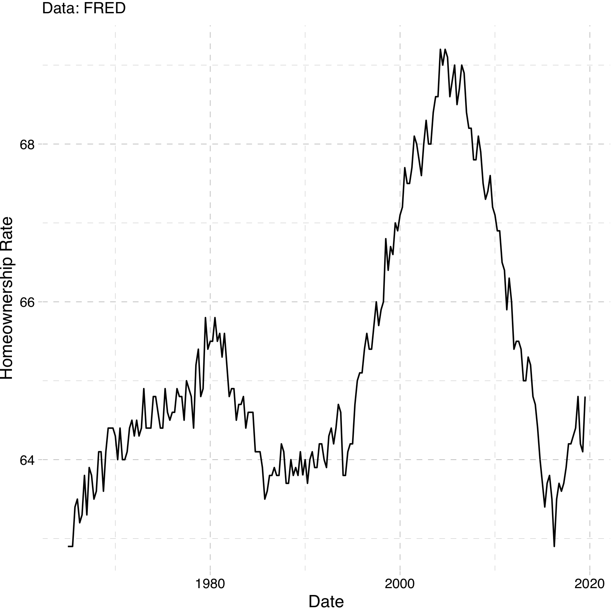
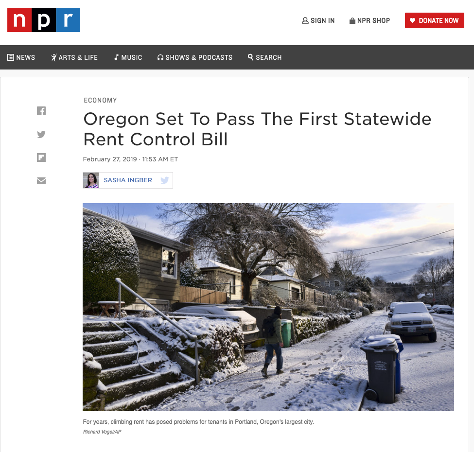
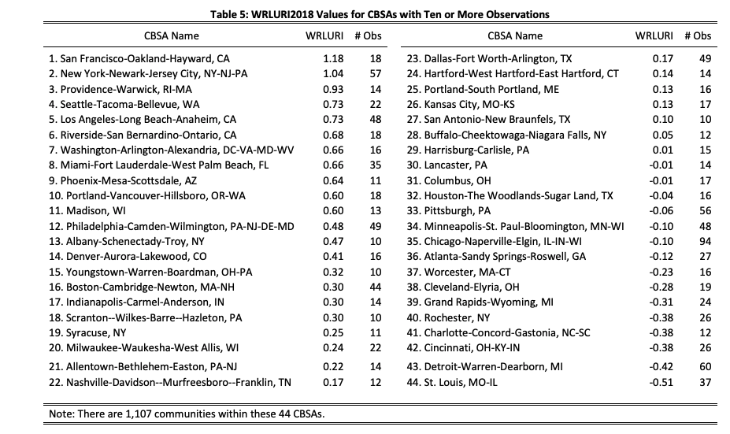
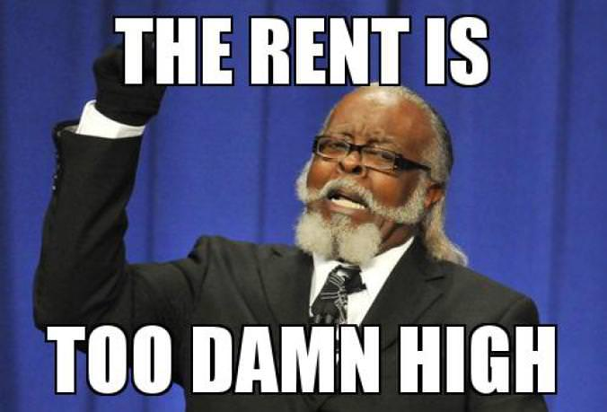

class: inverse, center, middle
  
```{R, setup, include = F}
options(htmltools.dir.version = FALSE)
library(pacman)
p_load(
  broom, here, tidyverse,
  latex2exp, ggplot2, ggthemes, viridis, extrafont, gridExtra,
  kableExtra,
  dplyr, magrittr, knitr, parallel, tufte,emo
)
# Define pink color
red_pink <- "#e64173"
turquoise <- "#20B2AA"
grey_light <- "grey70"
grey_mid <- "grey50"
grey_dark <- "grey20"
# Dark slate grey: #314f4f
# Knitr options
opts_chunk$set(
  comment = "#>",
  fig.align = "center",
  fig.height = 7,
  fig.width = 10.5,
  warning = F,
  message = F
)
opts_chunk$set(dev = "svg")
options(device = function(file, width, height) {
  svg(tempfile(), width = width, height = height)
})
# A blank theme for ggplot
theme_empty <- theme_bw() + theme(
  line = element_blank(),
  rect = element_blank(),
  strip.text = element_blank(),
  axis.text = element_blank(),
  plot.title = element_blank(),
  axis.title = element_blank(),
  plot.margin = structure(c(0, 0, -0.5, -1), unit = "lines", valid.unit = 3L, class = "unit"),
  legend.position = "none"
)
theme_simple <- theme_bw() + theme(
  line = element_blank(),
  panel.grid = element_blank(),
  rect = element_blank(),
  strip.text = element_blank(),
  axis.text.x = element_text(size = 18, family = "STIXGeneral"),
  axis.text.y = element_blank(),
  axis.ticks = element_blank(),
  plot.title = element_blank(),
  axis.title = element_blank(),
  # plot.margin = structure(c(0, 0, -1, -1), unit = "lines", valid.unit = 3L, class = "unit"),
  legend.position = "none"
)
theme_axes_math <- theme_void() + theme(
  text = element_text(family = "MathJax_Math"),
  axis.title = element_text(size = 22),
  axis.title.x = element_text(hjust = .95, margin = margin(0.15, 0, 0, 0, unit = "lines")),
  axis.title.y = element_text(vjust = .95, margin = margin(0, 0.15, 0, 0, unit = "lines")),
  axis.line = element_line(
    color = "grey70",
    size = 0.25,
    arrow = arrow(angle = 30, length = unit(0.15, "inches")
  )),
  plot.margin = structure(c(1, 0, 1, 0), unit = "lines", valid.unit = 3L, class = "unit"),
  legend.position = "none"
)
theme_axes_serif <- theme_void() + theme(
  text = element_text(family = "MathJax_Main"),
  axis.title = element_text(size = 22),
  axis.title.x = element_text(hjust = .95, margin = margin(0.15, 0, 0, 0, unit = "lines")),
  axis.title.y = element_text(vjust = .95, margin = margin(0, 0.15, 0, 0, unit = "lines")),
  axis.line = element_line(
    color = "grey70",
    size = 0.25,
    arrow = arrow(angle = 30, length = unit(0.15, "inches")
  )),
  plot.margin = structure(c(1, 0, 1, 0), unit = "lines", valid.unit = 3L, class = "unit"),
  legend.position = "none"
)
theme_axes <- theme_void() + theme(
  text = element_text(family = "Fira Sans Book"),
  axis.title = element_text(size = 18),
  axis.title.x = element_text(hjust = .95, margin = margin(0.15, 0, 0, 0, unit = "lines")),
  axis.title.y = element_text(vjust = .95, margin = margin(0, 0.15, 0, 0, unit = "lines")),
  axis.line = element_line(
    color = grey_light,
    size = 0.25,
    arrow = arrow(angle = 30, length = unit(0.15, "inches")
  )),
  plot.margin = structure(c(1, 0, 1, 0), unit = "lines", valid.unit = 3L, class = "unit"),
  legend.position = "none"
)
```


# Lecture XIV: Housing Policy
---


name: schedule
# Schedule

## Today

--

1) .hi.purple[Introduction]

2) .hi.purple[Two Models]

3) .hi.purple[Two Policies]


--

--

## Upcoming

  - .hi.slate[HW3 due Feb 25th (next class)]
  
  - .hi.slate[Reading] (Chapter 9)

--

---


# Housing Markets 

Before we dive in, let's distinguish the following:

- .hi[Rental] Market: Supply and Demand for .pink[rentals] 

- .hi.purple[Housing Market]: Supply and Demand for .purple[houses]


---


count: false
# Housing Markets 

Before we dive in, let's distinguish the following:

- .hi[Rental] Market: Supply and Demand for .pink[rentals] 

- .hi.purple[Housing Market]: Supply and Demand for .purple[houses]


Why is it important to distinguish these? Aren't they both markets for living spaces? .hi[Discuss]


---


count: false 
# Housing Markets 

Before we dive in, let's distinguish the following:

- .hi[Rental] Market: Supply and Demand for .pink[rentals] 

- .hi.purple[Housing Market]: Supply and Demand for .purple[houses]


Why is it important to distinguish these? Aren't they both markets for living spaces? .hi[Discuss]


  - A house is an asset. A month of rent is not
  
  - Homeowners are much less mobile than renters
  
  

---


count: false
# Homeownership

Why is buying a home different than buying a pair of jeans? (other than the difference in price)


---


count: false
# Homeownership

Why is buying a home different than buying a pair of jeans? (other than the difference in price)


 A house is a store of value. This value is subject to uncertainty. (This is what I mean by asset)
 


---


count: false
# Homeownership

Why is buying a home different than buying a pair of jeans? (other than the difference in price)


A house is a store of value. This value is subject to uncertainty. (This is what I mean by asset)
 
 - Fundamentally, purchasing a home is a dynamic (forward looking) decision
 
 - Jeans (a pure consumption good) are not really a store of value


---


count: false
# Homeownership

Why is buying a home different than buying a pair of jeans? (other than the difference in price)


A house is a store of value. This value is subject to uncertainty. (This is what I mean by asset)
 
 - Fundamentally, purchasing a home is a dynamic (forward looking) decision
 
 - Jeans (a pure consumption good) are not really a store of value


We will focus on renters. But first lets take a look at some data


---

# Rentals vs Homeowners

```{R, rent1, out.width = "65%", out.height = "65%", echo = F}

```


---


class: inverse, middle
# Checklist

.col-left[

1) .hi[Introduction] `r emo::ji("check")`


2) .hi.purple[Two Models] 


]

.col-right[
3) .hi.purple[Two Policies]
]

---


# Rental Market Model

Just like labor markets, each city has its own market for rental units 


---


count: false
# Rental Market Model

Just like labor markets, each city has its own market for rental units 

- Consists of suppliers (absentee landlords) 


---


count: false
# Rental Market Model

Just like labor markets, each city has its own market for rental units 

- Consists of suppliers (absentee landlords) 

- Individuals making optimal housing demand decisions


---


count: false
# Rental Market Model

Just like labor markets, each city has its own market for rental units 

- Consists of suppliers (absentee landlords) 

- Individuals making optimal housing demand decisions

__Important__: Structure of the market has big implications for policy

---


# Competitive Model

Very similar to the competitive labor market model


---

count: false
# Competitive Model

Very similar to the competitive labor market model

1) No invididual landlord can influence the price of rents

---


count: false
# Competitive Model

Very similar to the competitive labor market model

1) No invididual landlord can influence the price of rents

2) Landlords decide how much housing to provide

---


count: false
# Competitive Model

Very similar to the competitive labor market model

1) No invididual landlord can influence the price of rents

2) Landlords decide how much housing to provide

3) The amount of housing they provide will again come from profit maximization

__Important__: Labor market model: firm was deciding how much labor to hire. Now we will model the landlord as picking a quantity of housing to provide

---


# Competitive Model Math

Profit function given by:

\begin{align*}
\pi(Q) = P*Q - TC(Q)
\end{align*}


---


count: false
# Competitive Model Math

Profit function given by:

\begin{align*}
\pi(Q) = P*Q - TC(Q)
\end{align*}

- __Note__: Now cost is a function of quantity


---


count: false
# Competitive Model Math

Profit function given by:

\begin{align*}
\pi(Q) = P*Q - TC(Q)
\end{align*}

- __Note__: Now cost is a function of quantity

  - Implicitly we are assuming that at any quantity, the firm will use the optimal level of labor and capital

---


count: false
# Competitive Model Math

Profit function given by:

\begin{align*}
\pi(Q) = P*Q - TC(Q)
\end{align*}

- __Note__: Now cost is a function of quantity

  - Implicitly we are assuming that at any quantity, the firm will use the optimal level of labor and capital


Marginal profit equals zero , $\frac{\Delta \pi(Q)}{\Delta Q}= 0$:


---


count: false
# Competitive Model Math

Profit function given by:

\begin{align*}
\pi(Q) = P*Q - TC(Q)
\end{align*}

- __Note__: Now cost is a function of quantity

  - Implicitly we are assuming that at any quantity, the firm will use the optimal level of labor and capital


Marginal profit equals zero, $\frac{\Delta \pi(Q)}{\Delta Q}= 0$:

\begin{align*}
 \frac{P*\Delta Q}{\Delta Q} - \frac{\Delta TC(Q)}{\Delta Q} = 0
\end{align*}

---


count: false
# Competitive Model Math

Profit function given by:

\begin{align*}
\pi(Q) = P*Q - TC(Q)
\end{align*}

- __Note__: Now cost is a function of quantity

  - Implicitly we are assuming that at any quantity, the firm will use the optimal level of labor and capital


Marginal profit equals zero, $\frac{\Delta \pi(Q)}{\Delta Q}= 0$:

\begin{align*}
 \frac{P*\Delta Q}{\Delta Q} - \frac{\Delta TC(Q)}{\Delta Q} &= 0\\
 P &= \frac{\Delta TC(Q)}{\Delta Q}
\end{align*}

---


count: false
# Competitive Model Math

Profit function given by:

\begin{align*}
\pi(Q) = P*Q - TC(Q)
\end{align*}

- __Note__: Now cost is a function of quantity

  - Implicitly we are assuming that at any quantity, the firm will use the optimal level of labor and capital


Marginal profit equals zero, $\frac{\Delta \pi(Q)}{\Delta Q}= 0$:

\begin{align*}
 \frac{P*\Delta Q}{\Delta Q} - \frac{\Delta TC(Q)}{\Delta Q} &= 0\\
 P &= \frac{\Delta TC(Q)}{\Delta Q}\\
 P &= MC(Q)
\end{align*}

---


count: false
# Competitive Model Math

Profit function given by:

\begin{align*}
\pi(Q) = P*Q - TC(Q)
\end{align*}

- __Note__: Now cost is a function of quantity

  - Implicitly we are assuming that at any quantity, the firm will use the optimal level of labor and capital


Marginal profit equals zero, $\frac{\Delta \pi(Q)}{\Delta Q}= 0$:

\begin{align*}
 \frac{P*\Delta Q}{\Delta Q} - \frac{\Delta TC(Q)}{\Delta Q} &= 0\\
 P &= \frac{\Delta TC(Q)}{\Delta Q}\\
 P &= MC(Q)
\end{align*}

- .pink[Increasing Marginal costs] $\implies$ .pink[upward sloping supply curves!]


---


# The Monopoly Model

Now let's consider the monopoly situation:


---


count: false
# The Monopoly Model

Now let's consider the monopoly situation:

1) One seller of the good (rental units)


---


count: false
# The Monopoly Model

Now let's consider the monopoly situation:

1) One seller of the good (rental units)

2) Ability to set prices


---


count: false
# The Monopoly Model

Now let's consider the monopoly situation:

1) One seller of the good (rental units)

2) Ability to set prices

3) Still profit maximizing

---

# Monopoly: Math

- Again, the monopolist will still be a profit-maximizer

---


count: false
# Monopoly: Math

Again, the monopolist will still be a profit-maximizer

- TR is now given by: TR = P(Q)*Q


---


count: false
# Monopoly: Math

Again, the monopolist will still be a profit-maximizer

- TR is now given by: TR = P(Q)*Q

  - Quantity that the monopolist produces impacts the price
  

---


count: false
# Monopoly: Math

Again, the monopolist will still be a profit-maximizer

- TR is now given by: TR = P(Q)*Q

  - Quantity that the monopolist produces impacts the price
  - P(Q) _is_ the inverse demand function
  

---


count: false
# Monopoly: Math

Again, the monopolist will still be a profit-maximizer

- TR is now given by: TR = P(Q)*Q

  - Quantity that the monopolist produces impacts the price
  - P(Q) _is_ the inverse demand function (what you are used to seeing for demand)
  

---


count: false
# Monopoly: Math

Again, the monopolist will still be a profit-maximizer

- TR is now given by: TR = P(Q)*Q

  - Quantity that the monopolist produces impacts the price
  - P(Q) _is_ the inverse demand function (what you are used to seeing for demand)


__Profit is given by__

\begin{align*}
\pi(Q) = P(Q)*Q - TC(Q)
\end{align*}
  


---


# Monopoly: Profit Maxing

Profit Maximization gives us the familiar $\frac{\Delta \pi(Q)}{\Delta Q} = 0$


---


count: false
# Monopoly: Profit Maxing

Profit Maximization gives us the familiar $\frac{\Delta \pi(Q)}{\Delta Q} = 0$

\begin{align*}
\frac{\Delta P(Q)*Q}{\Delta Q} - \frac{\Delta TC(Q)}{\Delta Q} = 0 
\end{align*}
  
---


count: false
# Monopoly: Profit Maxing

Profit Maximization gives us the familiar $\frac{\Delta \pi(Q)}{\Delta Q} = 0$

\begin{align*}
\frac{\Delta P(Q)*Q}{\Delta Q} - \frac{\Delta TC(Q)}{\Delta Q} &= 0 \\
MR(Q) &= MC(Q)
\end{align*}


---


count: false
# Monopoly: Profit Maxing

Profit Maximization gives us the familiar $\frac{\Delta \pi(Q)}{\Delta Q} = 0$

\begin{align*}
\frac{\Delta P(Q)*Q}{\Delta Q} - \frac{\Delta TC(Q)}{\Delta Q} &= 0 \\
MR(Q) &= MC(Q)
\end{align*}

__Note__: Now, $\frac{\Delta P(Q)*Q}{\Delta Q} \neq P$.


---

# Monopoly Graph

```{R, m1, echo=F,fig.height = 4, fig.width = 7, dev = "svg", cache=T}
demandm <- function(x) 10 - 2*x
mr_m <- function(x) 10 - 4*x
supply <- function(x) 5+2*x

ggplot(data.frame(x=c(0, 3)), aes(x)) +
  stat_function(fun= demandm, col = "purple")+
  stat_function(fun = mr_m, col = red_pink)+
  stat_function(fun = supply, col = "#34B3FF" )+
  geom_vline(xintercept = 0)+
  geom_hline(yintercept = 0)+
  labs(x = "acres", y = "Price")+
  ggthemes::theme_pander()+
  annotate(x = 2.3, y = 2, label = "marginal revenue", "text")+
  annotate(x = 2.3, y = 6, label = "Demand", "text")+
  annotate(x = 2.3, y = 9, label = "Supply (marginal cost)", "text")


```

---


count: false
# Monopoly Graph

```{R, m2, echo=F,fig.height = 4, fig.width = 7, dev = "svg", cache=T}
ggplot(data.frame(x=c(0, 3)), aes(x)) +
  stat_function(fun= demandm, col = "purple")+
  stat_function(fun = mr_m, col = red_pink)+
  stat_function(fun = supply, col = "#34B3FF" )+
  geom_vline(xintercept = 0)+
  geom_hline(yintercept = 0)+
  labs(x = "acres", y = "Price")+
  ggthemes::theme_pander()+
  annotate(x = 2.3, y = 2, label = "Marginal Revenue", "text")+
  annotate(x = 2.3, y = 6, label = "Demand", "text")+
  annotate(x = 2.3, y = 9, label = "Supply (marginal cost)", "text")+
  geom_segment(aes(x = 5/6, xend = 5/6, y = 0, yend = supply(5/6)), linetype = "dashed")+
  geom_segment(aes(x = 5/6, xend = 5/6, y = 0, yend = demandm(5/6)), linetype = "dashed")+
  annotate(x = 5/6 , y = -.15, label = "Q_m", "text")
```

---


count: false
# Monopoly Graph

```{R, m3, echo=F,fig.height = 4, fig.width = 7, dev = "svg", cache=T}

ggplot(data.frame(x=c(0, 3)), aes(x)) +
  stat_function(fun= demandm, col = "purple")+
  stat_function(fun = mr_m, col = red_pink)+
  stat_function(fun = supply, col = "#34B3FF" )+
  geom_vline(xintercept = 0)+
  geom_hline(yintercept = 0)+
  labs(x = "acres", y = "Price")+
  ggthemes::theme_pander()+
  annotate(x = 2.3, y = 2, label = "Marginal Revenue", "text")+
  annotate(x = 2.3, y = 6, label = "Demand", "text")+
  annotate(x = 2.3, y = 9, label = "Supply (marginal cost)", "text")+
  geom_segment(aes(x = 5/6, xend = 5/6, y = 0, yend = supply(5/6)), linetype = "dashed")+
  geom_segment(aes(x = 5/6, xend = 5/6, y = 0, yend = demandm(5/6)), linetype = "dashed")+
  annotate(x = 5/6 , y = -.15, label = "Q_m", "text")+
  annotate(x =-.08 , y = demandm(5/6), label = "P_m", "text")+
  geom_segment(aes(x = 0, xend = 5/6, y = demandm(5/6), yend = demandm(5/6)), linetype = "dashed")


```

---

class: inverse, middle
# Checklist

.col-left[

1) .hi[Introduction] `r emo::ji("check")`


2) .hi[Two Models] `r emo::ji("check")`

  - Competitive Model
  - Monopoly Model


]

.col-right[
3) .hi.purple[Two Policies]
]

---

# Two Policies

- We will focus on two policies:


---


count: false
# Two Policies

- We will focus on two policies:

1) Rent Control

---


count: false
# Two Policies

- We will focus on two policies:

1) Rent Control

2) Land-Use Restrictions (you are familiar with these already)

- We will also look at how these could interact

---


# Rent Control

__Defn__ Rent Control: A _price ceiling_ set on rental units

  - Price Ceiling: Max allowed price on the market


---


count: false
# Rent Control

__Defn__ Rent Control: A _price ceiling_ set on rental units

  - Price Ceiling: Max allowed price on the market


Brief History (US):

  - Started around WW1. Expanded during WWII
  
---


count: false
# Rent Control

__Defn__ Rent Control: A _price ceiling_ set on rental units

  - Price Ceiling: Max allowed price on the market


Brief History (US):

  - Started around WW1. Expanded during WWII
  
  - 1970: Nixon puts 90 day freeze on prices to combat inflation

---


count: false
# Rent Control

__Defn__ Rent Control: A _price ceiling_ set on rental units

  - Price Ceiling: Max allowed price on the market


Brief History (US):

  - Started around WW1. Expanded during WWII
  
  - 1970: Nixon puts 90 day freeze on prices to combat inflation
  
  - _Mostly_ a .hi[place based policy]. 
  
  
---


count: false
# Rent Control

__Defn__ Rent Control: A _price ceiling_ set on rental units

  - Price Ceiling: Max allowed price on the market


Brief History (US):

  - Started around WW1. Expanded during WWII
  
  - 1970: Nixon puts 90 day freeze on prices to combat inflation
  
  - _Mostly_ a .hi[place based policy]. 
  
    - SF, NY, LA, Oakland, DC, Berkeley, West Hollywood
    
    - Oregon: first state to have .pink[state-wide rent control]

---


# Rent Control 

```{R, rentcontrol , out.width = "80%", out.height = "80%", echo = F}

```


---

# Rent Control in Oregon

- In 2019: Oregon passes .hi[state-wide] rent control 


---


count: false
# Rent Control in Oregon

- In 2019: Oregon passes .hi[state-wide] rent control 

- Limits annual rent increases to inflation + 7% (inflation is usually 2-3%)


---


count: false
# Rent Control in Oregon

- In 2019: Oregon passes .hi[state-wide] rent control 

- Limits annual rent increases to inflation + 7% (inflation is usually 2-3%)

- If tenants leave on their .pink[own accord], landlords can .purple[increase rent] without limit


---


count: false
# Rent Control in Oregon

- In 2019: Oregon passes state-wide rent control 

- Limits annual rent increases to inflation + 7% (inflation is usually 2-3%)

- If tenants leave on their .pink[own accord], landlords can .purple[increase rent] without limit

.hi[Question]: Are the ramifications from state-wide rent-control different than local rent control? Why?


---


# Land Use Restrictions

Land use restrictions limit what one is able to do with developable land. Examples:


---


count: false
# Land Use Restrictions

Land use restrictions limit what one is able to do with developable land. Examples:

1. Density Restrictions


---


count: false
# Land Use Restrictions

Land use restrictions limit what one is able to do with developable land. Examples:

1. Density Restrictions

2. Min Lot Sizes


---


count: false
# Land Use Restrictions

Land use restrictions limit what one is able to do with developable land. Examples:

1. Density Restrictions

2. Min Lot Sizes

3. Park Requirements


---


count: false

# Land Use Restrictions

Land use restrictions limit what one is able to do with developable land. Examples:

1. Density Restrictions

2. Min Lot Sizes

3. Park Requirements

4. Sidewalk and street size requirements

---


count: false

# Land Use Restrictions

Land use restrictions limit what one is able to do with developable land. Examples:

1. Density Restrictions

2. Min Lot Sizes

3. Park Requirements

4. Sidewalk and street size requirements

5. Height Restrictions

Not all of these are bad things. But they do make developing land more expensive.

---
 
 

 
 
# Wharton Index

```{R, rent8 , out.width = "80%", out.height = "80%", echo = F}

```

Higher values of the wharton index $\implies$ tighter land use restrictions

---


# Example


---


# A Model

Do Land-Use regs and rent control interact? Absolutely! Let's model it

--

\begin{align*}
P(Q_d) &= 20 - 2*Q_d\\
P(Q_s) &= 8 + Q_s\\
\end{align*}

Compute the equilibrium. Graph it, if that is helpful

--

- Now suppose the government ratchets up land-use regs. New supply is given by:

\begin{align*}
P(Q_s^{new}) = 8 + 2*Q_s^{new}
\end{align*}

--


---

# Example

Old eq: $Q^* = 4$, $P^* = 12$

New eq: $Q^* = 3$, $P^* = 15$


Government comes in and says the rents are too high. Rent control set at $12$ per unit. Now you have:

\begin{align*}
12 = 8+2*Q_s \implies Q_s = 2
\end{align*}
---


count: false
# Example

Old eq: $Q^* = 4$, $P^* = 12$

New eq: $Q^* = 3$, $P^* = 15$


Government comes in and says the rents are too high. Rent control set at $12$ per unit. Now you have:

\begin{align*}
12 = 8+2*Q_s &\implies Q_s = 2\\
12 = 20 - 2*Q_d &\implies Q_d = 4
\end{align*}

---


count: false
# Example

Old eq: $Q^* = 4$, $P^* = 12$

New eq: $Q^* = 3$, $P^* = 15$


Government comes in and says the rents are too high. Rent control set at $12$ per unit. Now you have:

\begin{align*}
12 = 8+2*Q_s &\implies Q_s = 2\\
12 = 20 - 2*Q_d &\implies Q_d = 4
\end{align*}

So we have a .pink[shortage] of two units at the .hi.purple[old] equilibrium price. `r emo::ji("anguished")`
---


# A Note

We wont have time (but it might be good practice) for you to think through what would happen if the market was a .hi[monopoly]


---


count: false
# A Note

We wont have time (but it might be good practice) for you to think through what would happen if the market was a .hi[monopoly]

  - Similar to the .hi.purple[monopsonist], rent control can actually .pink[lower prices] in a completely .purple[monopolized] housing market


---


count: false
# A Note

We wont have time (but it might be good practice) for you to think through what would happen if the market was a .hi[monopoly]

  - Similar to the .hi.purple[monopsonist], rent control can actually .pink[lower prices] in a completely .purple[monopolized] housing market

  - Let's take a (quick) look at some recent empirical evidence

---

# Empirics

__Empirical Evidence__: [Diamond et. al (2019)](https://web.stanford.edu/~diamondr/DMQ.pdf)

  - 1979: Rent control in SF put in place for all standing buildings with 5 apartments or more
  

---

count: false
# Empirics

__Empirical Evidence__: [Diamond et. al (2019)](https://web.stanford.edu/~diamondr/DMQ.pdf)

  - 1979: Rent control in SF put in place for all standing buildings with 5 apartments or more
  
    - New buildings exempt (to promote developers to continue building)
  


---


count: false
# Empirics

__Empirical Evidence__: [Diamond et. al (2019)](https://web.stanford.edu/~diamondr/DMQ.pdf)

  - 1979: Rent control in SF put in place for all standing buildings with 5 apartments or more
  
    - New buildings exempt (to promote developers to continue building)
  
    - Small multi-family apartment buildings ("mom & pop") exempted
    
  
---


count: false
# Empirics

__Empirical Evidence__: [Diamond et. al (2019)](https://web.stanford.edu/~diamondr/DMQ.pdf)

  - 1979: Rent control in SF put in place for all standing buildings with 5 apartments or more
  
    - New buildings exempt (to promote developers to continue building)
  
    - Small multi-family apartment buildings ("mom & pop") exempted
    
  - 1994: Exemption for small multi-family buildings removed. All apartments .hi[built before 1980] subject to rent control
    
  
---

# Empirics: Findings

In this study:

- .hi.slate[Treatment]: Those living in small apartment complexes (5 or less) built in 1979 or before


---


count: false
# Empirics: Findings

In this study:

- .hi.slate[Treatment]: Those living in small apartment complexes (5 or less) built in 1979 or before

- .hi.slate[Control]: Those living in small apartments complexes (5 or less) built after 1979 (not subject to rent control)


---


count: false
# Empirics: Findings

In this study:

- .hi.slate[Treatment]: Those living in small apartment complexes (5 or less) built in 1979 or before

- .hi.slate[Control]: Those living in small apartments complexes (5 or less) built after 1979 (not subject to rent control)

A fair comparison? Maybe concerned that those living in apartments built before or after 1979 are systematically different.

---


count: false
# Empirics: Findings

In this study:

- .hi.slate[Treatment]: Those living in small apartment complexes (5 or less) built in 1979 or before

- .hi.slate[Control]: Those living in small apartments complexes (5 or less) built after 1979 (not subject to rent control)

A fair comparison? Maybe concerned that those living in apartments built before or after 1979 are systematically different

- .hi.slate[Main Findings]: 

1) .purple[Renter mobility] was reduced by about 20%


---


count: false
# Empirics: Findings

In this study:

- .hi.slate[Treatment]: Those living in small apartment complexes (5 or less) built in 1979 or before

- .hi.slate[Control]: Those living in small apartments complexes (5 or less) built after 1979 (not subject to rent control)

A fair comparison? Maybe concerned that those living in apartments built before or after 1979 are systematically different

- .hi.slate[Main Findings]: 

1) .purple[Renter mobility] was reduced by about 20%

2) .pink[Housing Supply] was reduced by about 15%

---


# So What?

__Moral of the story__: Yes, in SF:

.pull-left[
```{R, th1 , out.width = "100%", out.height = "100%", echo = F}

```
]


---


count: false
# So What?

__Moral of the story__: Yes, in SF:

.pull-left[
```{R, th3, out.width = "100%", out.height = "100%", echo = F}

```
]

.pull-right[
  - Are rent controls the best fix? 
    

]


---


count: false
# So What?

__Moral of the story__: Yes, in SF:

.pull-left[
```{R, th4 , out.width = "100%", out.height = "100%", echo = F}

```
]

.pull-right[
  - Are rent controls the best fix? 
  
      - (In SF, probably not)
      
      - Other empirical evidence suggesting rent control went poorly in NY as well
  
]


---


count: false
# So What?

__Moral of the story__: Yes, in SF:

.pull-left[
```{R, th5 , out.width = "100%", out.height = "100%", echo = F}

```
]

.pull-right[
  - Are rent controls the best fix? 
  
      - (In SF, probably not)
      
      - Other empirical evidence suggesting rent control went poorly in NY as well
  
  - Could possibly fix the CA housing crises by .pink[letting people build houses]
  
]


---

class: inverse, middle
# Checklist

.col-left[

1) .hi[Introduction] `r emo::ji("check")`


2) .hi[Two Models] `r emo::ji("check")`

  - Competitive Model
  - Monopoly Model


]

.col-right[
3) .hi[Two Policies] `r emo::ji("check")`
  
  - Land-Use Regulations
  - Rent Control
]

---

exclude: true

```{r decktape}
p_load(pagedown)
pagedown::chrome_print(here::here("014-rent_control","lecture_14.html"))
```


<!-- --- -->
<!-- exclude: true -->

<!-- ```{R, generate pdfs, include = F} -->
<!-- system("decktape remark 02_goodsmarket_part1.html 02_goodsmarket_part1.pdf --chrome-arg=--allow-file-access-from-files") -->
<!-- ``` -->


