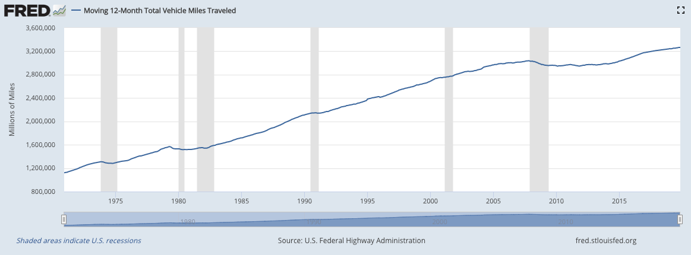
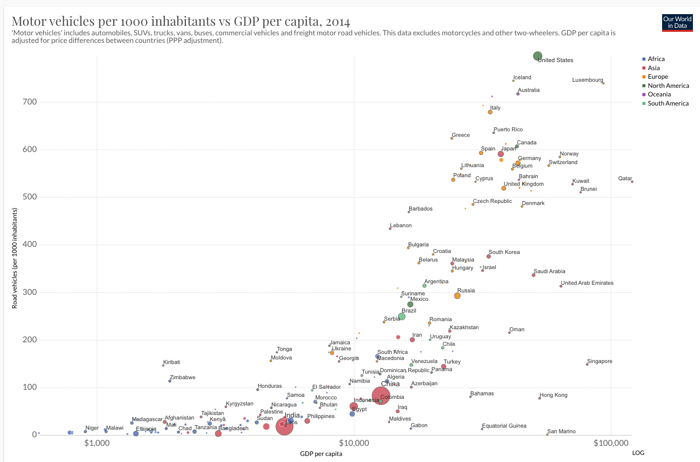
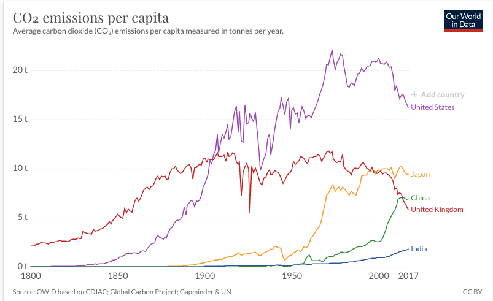
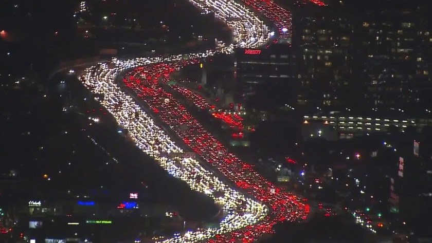
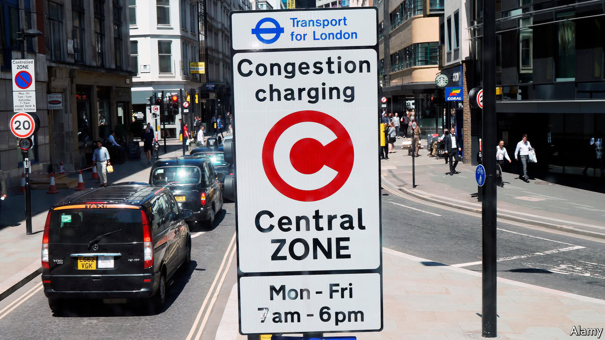
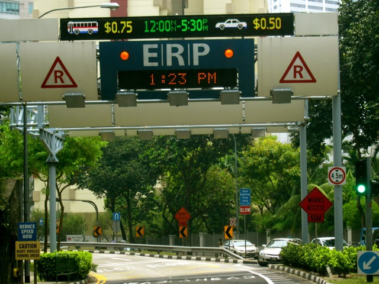
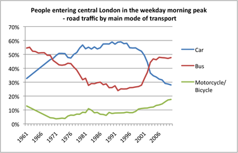

class: inverse, center, middle

```{R, setup, include = F}
options(htmltools.dir.version = FALSE)
library(pacman)
p_load(
  broom, here, tidyverse,
  latex2exp, ggplot2, ggthemes, viridis, extrafont, gridExtra,
  kableExtra,
  dplyr, magrittr, knitr, parallel, tufte,emo
)
# Define pink color
red_pink <- "#e64173"
turquoise <- "#20B2AA"
grey_light <- "grey70"
grey_mid <- "grey50"
grey_dark <- "grey20"
# Dark slate grey: #314f4f
# Knitr options
opts_chunk$set(
  comment = "#>",
  fig.align = "center",
  fig.height = 7,
  fig.width = 10.5,
  warning = F,
  message = F
)
opts_chunk$set(dev = "svg")
options(device = function(file, width, height) {
  svg(tempfile(), width = width, height = height)
})

```


# Lecture XV: Highways Pt 1

---


name: schedule
# Schedule

## Today

--

1) .hi.purple[US Auto Use]

2) .hi.purple[Externalities]

3) .hi.purple[Congestion Pricing]


--

--

## Upcoming

  - .hi.slate[Book Report Due March 11th]
  
--

---

# Vehicle Miles Traveled

```{R, fred, out.width = "90%", out.height = "58%", echo = F}

```

---

# US: People like Cars

```{R, wc, out.width = "90%", out.height = "58%", echo = F}

```
---

# Carbon Emissions

```{R, pc, out.width = "90%", out.height = "58%", echo = F}

```


---


# Carbon Emissions

```{R, te, out.width = "90%", out.height = "58%", echo = F}
include_graphics("figures/tot_emis.png")
```

---


# A Question

__Important Policy Questions__: 

  - How do we reduce $CO_2$ per capita emissions in the US?
  

---


count: false

# A Question

__Important Policy Questions__: 

  - How do we reduce $CO_2$ per capita emissions in the US?
  
  - How do we keep per capita $CO_2$ emissions in China from exploding?
  

---


count: false

# A Question

__Important Policy Questions__: 

  - How do we reduce $CO_2$ per capita emissions in the US?
  
  - How do we keep per capita $CO_2$ emissions in China from exploding?
  
Future of global carbon emissions depends heavily on how car ownership rates evolve in China.

---


class: inverse, middle
# Checklist

.col-left[

1) .hi[US Auto Use] `r emo::ji("check")`


2) .hi.purple[Externalities] 


]

.col-right[
3) .hi.purple[Congestion Pricing]
]

---

# Externalities

Question:

  - Are the costs of driving entirely internalized by the driver?
  
--

Answer: No!

- __Axiom 3__: Externalities cause inefficiency

--

---

#Externalities

What are some externalities from driving?

---


count: false
#Externalities

What are some externalities from driving?

1. Congestion


---


count: false
#Externalities

What are some externalities from driving?

1. Congestion

2. Environmental Damage

---


count: false
#Externalities

What are some externalities from driving?

1. Congestion

2. Environmental Damage

3. Collisions

---


count: false
#Externalities

What are some externalities from driving?

1. Congestion

2. Environmental Damage

3. Collisions

4. Blight (parking lots instead of parks)

---


count: false
#Externalities

What are some externalities from driving?

1. Congestion

2. Environmental Damage

3. Collisions

4. Blight (parking lots instead of parks)

5. Noise Pollution

--

.hi.slate[Today:] we will focus on congestion externalities

--

---


#Externalities

How costly is .pink[congestion]?


---


count: false
#Externalities

How costly is .pink[congestion]?

- Typical commuter spends .hi[47 hours per year] in traffic


---


count: false
#Externalities

How costly is .pink[congestion]?

- Typical commuter spends .hi[47 hours per year] in traffic

  - __Very high__ in some metro areas (LA: 93, SF: 72, Atlanta: 67)


---


count: false
#Externalities

How costly is .pink[congestion]?

- Typical commuter spends .hi[47 hours per year] in traffic

  - __Very high__ in some metro areas (LA: 93, SF: 72, Atlanta: 67)

  - Estimated gasoline cost due to congestion delays: .hi[5 billion per year]
  

---


count: false
#Externalities

How costly is .pink[congestion]?

- Typical commuter spends .hi[47 hours per year] in traffic

  - __Very high__ in some metro areas (LA: 93, SF: 72, Atlanta: 67)

  - Estimated gasoline cost due to congestion delays: .hi[5 billion per year]
  
  - Time + Gas cost estimate: .hi[63 billion per year]


---

# Modeling Externalities

Let's start by assuming the only externality from driving is congestion


---


count: false
# Modeling Externalities

Let's start by assuming the only externality from driving is congestion

- .hi[Marginal Social Cost] (MSC): Added cost to _society_ from one extra unit of production

  - __Note__: $MSC \neq  MC$


---


count: false
# Modeling Externalities

Let's start by assuming the only externality from driving is congestion

- .hi[Marginal Social Cost] (MSC): Added cost to _society_ from one extra unit of production

  - __Note__: $MSC \neq  MC$

- MSC is the marginal cost (private) plus the marginal external cost (social)

---


count: false
# Modeling Externalities

Let's start by assuming the only externality from driving is congestion

- .hi[Marginal Social Cost] (MSC): Added cost to _society_ from one extra unit of production

  - __Note__: $MSC \neq  MC$

- MSC is the marginal cost (private) plus the marginal external cost (social)


---


count: false
# Modeling Externalities

Let's start by assuming the only externality from driving is congestion

- .hi[Marginal Social Cost] (MSC): Added cost to _society_ from one extra unit of production

  - __Note__: $MSC \neq  MC$

- MSC is the marginal cost (private) plus the marginal external cost (social)


---

# Congestion Externalities

- MEC from congestion = $m\cdot v\cdot c$ where


---


count: false
# Congestion Externalities

- MEC from congestion = $m\cdot v\cdot c$ where

  - $m$ is the additional time in traffic from an extra vehicle on the road
  

---

count: false
# Congestion Externalities


- MEC from congestion = $m\cdot v\cdot c$ where

  - $m$ is the additional time in traffic from an extra vehicle on the road
  
  - $v$ is the number of other road users
  
---


count: false
# Congestion Externalities


- MEC from congestion = $m\cdot v\cdot c$ where

  - $m$ is the additional time in traffic from an extra vehicle on the road
  
  - $v$ is the number of other road users
  
  - $c$ is the oppurtunity cost of time

---


count: false
# Congestion Externalities

- MEC from congestion = $m\cdot v\cdot c$ where

  - $m$ is the additional time in traffic from an extra vehicle on the road
  
  - $v$ is the number of other road users
  
  - $c$ is the oppurtunity cost of time

__Note__: When there are few cares on the road, $m$ and $v$ are relatively small


---


count: false
# Congestion Externalities

- MEC from congestion = $m\cdot v\cdot c$ where

  - $m$ is the additional time in traffic from an extra vehicle on the road
  
  - $v$ is the number of other road users
  
  - $c$ is the oppurtunity cost of time

__Note__: When there are few cares on the road, $m$ and $v$ are relatively small

  - As the number of cars increases, MEC increases (it is nonlinear)

  - Also: the above formula makes a strong assumption, what is it?
  
---

# Another Graph


---


class: inverse, middle
# Checklist

.col-left[

1) .hi[US Auto Use] `r emo::ji("check")`


2) .hi[Externalities]  `r emo::ji("check")`


]

.col-right[
3) .hi.purple[Congestion Pricing]
]

---


# So what?

Okay, congestion is an issue, how do we fix it?

--

.hi[Popular Answer:] Build more roads
  
  - Thought: if we build more roads, then congestion will decrease since there will be more space on the road

--

- .qa[Q]: What is the _crucial_ assumption we make when stating: "building roads will reduce congestion"

--

  - .qa[A]: The number of drivers will remain the same before and after the road is built

--

---

# LA Traffic 

```{R, la, out.width = "90%", out.height = "58%", echo = F}

```

---


# A Predictable Response

More people driving when a new road is built is easy to understand

---


count: false
# A Predictable Response

More people driving when a new road is built is easy to understand


1. People avoid driving because it is costly


---


count: false

# A Predictable Response

More people driving when a new road is built is easy to understand


1. People avoid driving because it is costly

2. Building a new road makes it less costly


---


count: false

# A Predictable Response

More people driving when a new road is built is easy to understand


1. People avoid driving because it is costly

2. Building a new road makes it less costly

3. Some people were _on the margin_ of driving, and the new road pushes them over

---


# So what?

Roads: Not a great solution. Better idea?


---


count: false

# So what?

Roads: Not a great solution. Better idea?

## .pink[Pigouvian Taxes:]

---


count: false

# So what?

Roads: Not a great solution. Better idea?

## .pink[Pigouvian Taxes:]

  - __Main insight__: social cost of driving exceeds private

---


count: false

# So what?

Roads: Not a great solution. Better idea?

## .pink[Pigouvian Taxes:]

  - __Main insight__: social cost of driving exceeds private
  
  - Inidividuals do not bear full cost of action, so they engage in it too often
  
---


count: false

# So what?

Roads: Not a great solution. Better idea?

## .pink[Pigouvian Taxes:]

  - __Main insight__: social cost of driving exceeds private
  
  - Inidividuals do not bear full cost of action, so they engage in it too often
  
  - Raise individual price until social cost = private cost $\implies$ people drive less 
  
  - Done via a tax (in this case: congestion)

---


# Where is it?


```{R, london_pricing, out.width = "90%", out.height = "58%", echo = F}

```


---


# Where is it?


```{R, singapore_pricing, out.width = "90%", out.height = "58%", echo = F}

```


---


# What Happened ?


```{R, lc, out.width = "80%", out.height = "80%", echo = F}

```


---


# Model with Pigouvian Taxes


---

# Peak vs. Off Period Taxes


---

# Mechanisms

Model demonstrated congestion taxes reduce traffic volume. How?


---


count: false

# Mechanisms

Model demonstrated congestion taxes reduce traffic volume. How?


1. Modal substition: switch to carpool, public transit


---


count: false

# Mechanisms

Model demonstrated congestion taxes reduce traffic volume. How?


1. Modal substition: switch to carpool, public transit

2. Switch to off-peak travel


---


count: false

# Mechanisms

Model demonstrated congestion taxes reduce traffic volume. How?


1. Modal substition: switch to carpool, public transit

2. Switch to off-peak travel

3. Switch route


---


count: false

# Mechanisms

Model demonstrated congestion taxes reduce traffic volume. How?


1. Modal substition: switch to carpool, public transit

2. Switch to off-peak travel

3. Switch route

4. Location decisions: change residence or workplace, cutting travel distance

---


# Discussion

Congestion taxes sound like a good idea, right? What are the problems? .hi.purple[Discuss]

--

- Roads aren't always congested. So tax needs to be time-varying. Gets very complicated

- Are all autos charged the same amount (semis and prius?)

--

---


class: inverse, middle
# Checklist

.col-left[

1) .hi[US Auto Use] `r emo::ji("check")`


2) .hi[Externalities] `r emo::ji("check")`


]

.col-right[
3) .hi[Congestion Pricing] `r emo::ji("check")`
]

---


exclude: true


