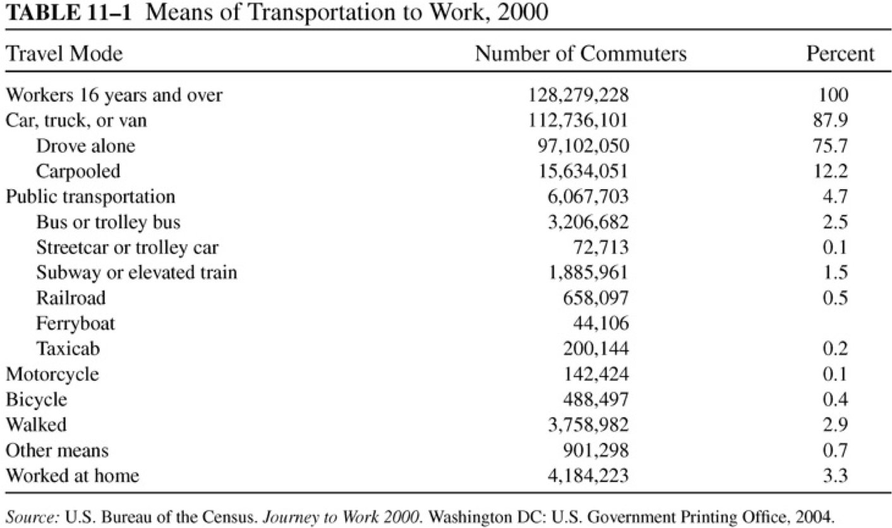
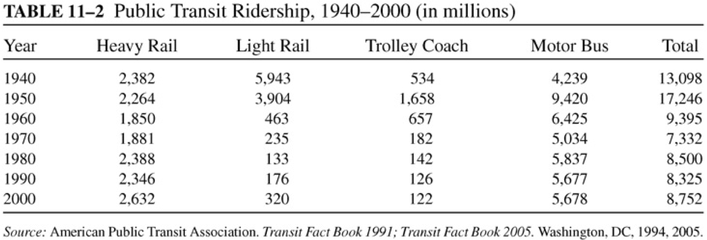
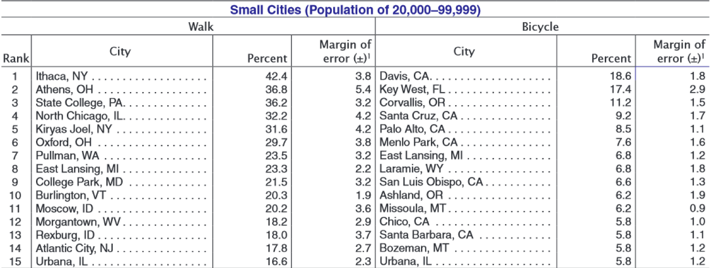
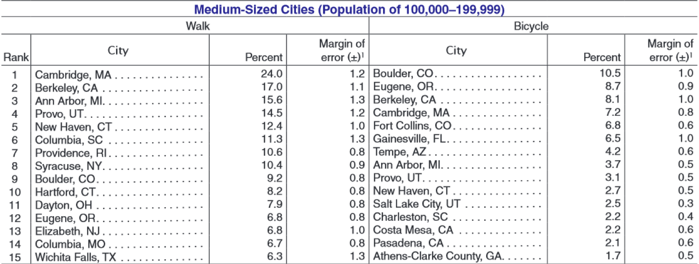
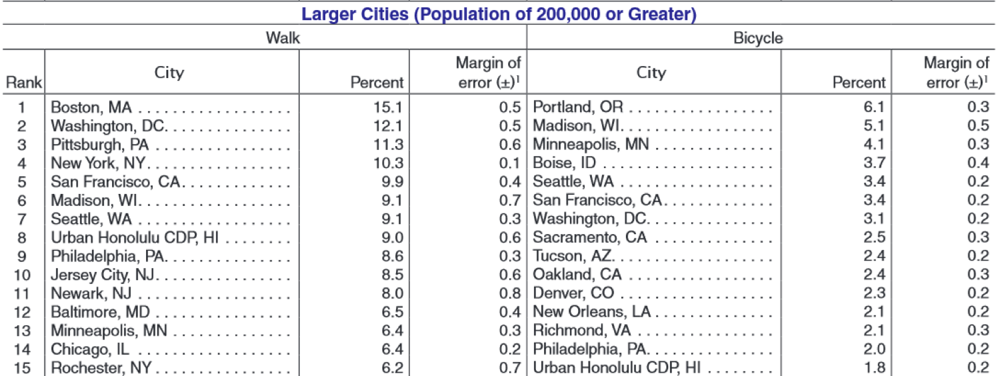

class: inverse, center, middle

```{R, setup, include = F}
options(htmltools.dir.version = FALSE)
library(pacman)
p_load(
  broom, here, tidyverse,
  latex2exp, ggplot2, ggthemes, viridis, extrafont, gridExtra,
  kableExtra,
  dplyr, magrittr, knitr, parallel, tufte,emo
)
# Define pink color
red_pink <- "#e64173"
turquoise <- "#20B2AA"
grey_light <- "grey70"
grey_mid <- "grey50"
grey_dark <- "grey20"
# Dark slate grey: #314f4f
# Knitr options
opts_chunk$set(
  comment = "#>",
  fig.align = "center",
  fig.height = 7,
  fig.width = 10.5,
  warning = F,
  message = F
)
opts_chunk$set(dev = "svg")
options(device = function(file, width, height) {
  svg(tempfile(), width = width, height = height)
})

```


# Lecture 17: Urban Transportation

---


name: schedule
# Schedule

## Today

--

1) .hi.purple[Urban Transit Overview]

2) .hi.purple[Transit Choice Math]

3) .hi.purple[Trains and Buses]

4) .hi.purple[A word on Ridesharing]

--

--

## Upcoming

  - .hi.slate[Book Report Due March 8th]
  
--

---


# Overview

One way to combat almost all externalities from driving: .hi[urban transit]


---


count: false
# Overview

One way to combat almost all externalities from driving: .hi[urban transit]


1. Reduces emissions

2. Reduces congestion


---


count: false
# Overview

One way to combat almost all externalities from driving: .hi[urban transit]


1. Reduces emissions

2. Reduces congestion

3. Reduces collisions

4. Concentrates noise pollution


---


count: false
# Overview

One way to combat almost all externalities from driving: .hi[urban transit]


1. Reduces emissions

2. Reduces congestion

3. Reduces collisions

4. Concentrates noise pollution


Great! Must be some bad things, right?


---


# Overview

.qa[Question]: What do you dislike about public transit?


---


count: false
# Overview

.qa[Question]: What do you dislike about public transit? __Typical Answers__:

  - Takes too much time

  - Too expensive


---


count: false
# Overview

.qa[Question]: What do you dislike about public transit? __Typical Answers__:

  - Takes too much time
  
  - Too expensive
  
  - Stange sights and smells
  
  - Can't find a seat at busy times


---


count: false
# Overview

.qa[Question]: What do you dislike about public transit? __Typical Answers__:

  - Takes too much time
  
  - Too expensive
  
  - Stange sights and smells
  
  - Can't find a seat at busy times


Perfectly reasonable responses. All of these things suck

---


# Overview

So, public transit fixes a ton of external problems we are worried about, but raises a new set of questions:


---


count: false
# Overview

So, public transit fixes a ton of external problems we are worried about, but raises a new set of questions:


1. How do we get people to use it?

2. When are Buses better than rail?


---


count: false
# Overview

So, public transit fixes a ton of external problems we are worried about, but raises a new set of questions:


1. How do we get people to use it?

2. When are Buses better than rail?

3. What population density is required to support public transit?

4. Can public transit ever be profitable?

---


# Examples

Everyone has probably experienced cities with public transit they like and dislike


---

# Transit to and from work in the US


```{R, transit1, out.width = "90%", out.height = "90%", echo = F}

```

---


# US Public Ridership over time


```{R, transit2, out.width = "90%", out.height = "90%", echo = F}

```


---

class: inverse, middle
# Checklist

.col-left[
1) .hi[Urban Transit Overview] `r emo::ji("check")`


2) .hi.purple[Transit Choice Math]

]

.col-right[
3) .hi.purple[Trains and Buses]

4) .hi.purple[A word on Ridesharing]


]


---


# Modeling Trip Cost

We can model trip costs as:

\begin{align*}
Cost = m + T_a\cdot d_a + T_v \cdot d_v
\end{align*}

where 

- m: monetary cost

--

- $T_a$: access time (getting to or waiting for transit)

- $d_a$: marginal disutility of access time

--

--

- $T_v$: Travel time 

- $d_v$: Marginal disutility of travel time

--

---

# Modeling Trip Cost

In general, $d_a > d_v$. What does this mean? .hi.purple[Discuss]

--

- Marginal disutility of waiting for a bus (or train) exceeds riding in one.

--

Can you use this model to explain why most people commute via car? (in the US)


--

- For cars, $T_a\cdot d_a$ is very small

- Aditionally, for many: $d_v^{car}> d_v^{transit}$, even when $T_v^{car} = T_v^{transit}$

--

Is $T_v^{car} = T_v^{transit}$? 

---


count: false
# Modeling Trip Cost

In general, $d_a > d_v$. What does this mean? .hi.purple[Discuss]


- Marginal disutility of waiting for a bus (or train) exceeds riding in one


Can you use this model to explain why most people commute via car? (in the US)


- For cars, $T_a\cdot d_a$ is very small

- Aditionally, for many: $d_v^{car}> d_v^{transit}$, even when $T_v^{car} = T_v^{transit}$


Is $T_v^{car} = T_v^{transit}$ (usually)? .hi[No!]

---

# An Example

Using the table, figure out which mode of transit the individual will take

<style type="text/css">
.tg  {border-collapse:collapse;border-spacing:0;}
.tg td{font-family:Arial, sans-serif;font-size:14px;padding:10px 5px;border-style:solid;border-width:1px;overflow:hidden;word-break:normal;border-color:black;}
.tg th{font-family:Arial, sans-serif;font-size:14px;font-weight:normal;padding:10px 5px;border-style:solid;border-width:1px;overflow:hidden;word-break:normal;border-color:black;}
.tg .tg-0lax{text-align:left;vertical-align:top}
.tg .tg-0pky{border-color:inherit;text-align:left;vertical-align:top}
.tg .tg-73a0{font-size:12px;border-color:inherit;text-align:left;vertical-align:top}
</style>
<table class="tg">
  <tr>
    <th class="tg-0lax"></th>
    <th class="tg-0lax">Walking</th>
    <th class="tg-0lax">Biking</th>
    <th class="tg-0lax">Car</th>
    <th class="tg-0lax">Bus</th>
  </tr>
  <tr>
    <td class="tg-0lax">Monetary Cost</td>
    <td class="tg-0pky">0.1</td>
    <td class="tg-0lax">0.2</td>
    <td class="tg-0lax">0.5</td>
    <td class="tg-73a0">2</td>
  </tr>
  <tr>
    <td class="tg-0lax">Access Time</td>
    <td class="tg-0pky">0</td>
    <td class="tg-0lax">1</td>
    <td class="tg-0lax">2</td>
    <td class="tg-0pky">5</td>
  </tr>
  <tr>
    <td class="tg-0lax">Marginal disutility per min<br>for access (in dollars)</td>
    <td class="tg-0lax">1</td>
    <td class="tg-0lax">1</td>
    <td class="tg-0lax">1</td>
    <td class="tg-0lax">1</td>
  </tr>
  <tr>
    <td class="tg-0lax">In-vehicle time</td>
    <td class="tg-0lax">12</td>
    <td class="tg-0lax">6</td>
    <td class="tg-0lax">3</td>
    <td class="tg-0lax">4</td>
  </tr>
  <tr>
    <td class="tg-0lax">Marginal disutility per in <br>vehicle min (in dollars)</td>
    <td class="tg-0lax">0.5</td>
    <td class="tg-0lax">1</td>
    <td class="tg-0lax">0.5</td>
    <td class="tg-0lax">0.25</td>
  </tr>
  <tr>
    <td class="tg-0lax">Trip Cost</td>
    <td class="tg-0lax"></td>
    <td class="tg-0lax"></td>
    <td class="tg-0lax"></td>
    <td class="tg-0lax"></td>
  </tr>
</table>
---

count: false
# An Example

Using the table, figure out which mode of transit the individual will take

<style type="text/css">
.tg  {border-collapse:collapse;border-spacing:0;}
.tg td{font-family:Arial, sans-serif;font-size:14px;padding:10px 5px;border-style:solid;border-width:1px;overflow:hidden;word-break:normal;border-color:black;}
.tg th{font-family:Arial, sans-serif;font-size:14px;font-weight:normal;padding:10px 5px;border-style:solid;border-width:1px;overflow:hidden;word-break:normal;border-color:black;}
.tg .tg-0lax{text-align:left;vertical-align:top}
.tg .tg-0pky{border-color:inherit;text-align:left;vertical-align:top}
.tg .tg-73a0{font-size:12px;border-color:inherit;text-align:left;vertical-align:top}
</style>
<table class="tg">
  <tr>
    <th class="tg-0lax"></th>
    <th class="tg-0lax">Walking</th>
    <th class="tg-0lax">Biking</th>
    <th class="tg-0lax">Car</th>
    <th class="tg-0lax">Bus</th>
  </tr>
  <tr>
    <td class="tg-0lax">Monetary Cost</td>
    <td class="tg-0pky">0.1</td>
    <td class="tg-0lax">0.2</td>
    <td class="tg-0lax">0.5</td>
    <td class="tg-73a0">2</td>
  </tr>
  <tr>
    <td class="tg-0lax">Access Time</td>
    <td class="tg-0pky">0</td>
    <td class="tg-0lax">1</td>
    <td class="tg-0lax">2</td>
    <td class="tg-0pky">5</td>
  </tr>
  <tr>
    <td class="tg-0lax">Marginal disutility per min<br>for access (in dollars)</td>
    <td class="tg-0lax">1</td>
    <td class="tg-0lax">1</td>
    <td class="tg-0lax">1</td>
    <td class="tg-0lax">1</td>
  </tr>
  <tr>
    <td class="tg-0lax">In-vehicle time</td>
    <td class="tg-0lax">12</td>
    <td class="tg-0lax">6</td>
    <td class="tg-0lax">3</td>
    <td class="tg-0lax">4</td>
  </tr>
  <tr>
    <td class="tg-0lax">Marginal disutility per in <br>vehicle min (in dollars)</td>
    <td class="tg-0lax">0.5</td>
    <td class="tg-0lax">1</td>
    <td class="tg-0lax">0.5</td>
    <td class="tg-0lax">0.25</td>
  </tr>
  <tr>
    <td class="tg-0lax">Trip Cost</td>
    <td class="tg-0lax">6.1</td>
    <td class="tg-0lax">7.2</td>
    <td class="tg-0lax">4</td>
    <td class="tg-0lax">8</td>
  </tr>
</table>

- They drive!

---


#Data

```{R, walking, out.width = "90%", out.height = "90%", echo = F}

```


---


# Data

```{R, walking2, out.width = "90%", out.height = "90%", echo = F}

```


---


# Data

```{R, walking3, out.width = "90%", out.height = "90%", echo = F}

```


---

# Back to the Model

Using our simple model, what ways can we incentivize people to drive less?


---


count: false
# Back to the Model

Using our simple model, what ways can we incentivize people to drive less?

- Price mechanisms (change $m$)

- More access points (change $T_a$)


---


count: false
# Back to the Model

Using our simple model, what ways can we incentivize people to drive less?


- Price mechanisms (change $m$)

- More access points (change $T_a$)

- More efficient public transit (change $T_v$)

- More clean public transit (change $d_v$)


---


count: false
# Back to the Model

Using our simple model, what ways can we incentivize people to drive less?

- Price mechanisms (change $m$)

- More access points (change $T_a$)

- More efficient public transit (change $T_v$)

- More clean public transit (change $d_v$)


Probably hard to do much to $d_a$ (why?)


---


class: inverse, middle
# Checklist

.col-left[
1) .hi[Urban Transit Overview] `r emo::ji("check")`


2) .hi[Transit Choice Math] `r emo::ji("check")`

]

.col-right[

3) .hi.purple[Trains and Buses]

4) .hi.purple[A word on Ridesharing]


]


---


# Trains and Buses

Now let's discuss some costs and benefits to:

1. Buses

2. Trains

--

Can you think of any?

--


---


# Buses 

## Advantages 

- Integrated: commuters can make the entire trip on one vehicle without switching
- Time between Buses can be shorter

---


count: false
# Buses 

## Advantages 

- Integrated: commuters can make the entire trip on one vehicle without switching
- Time between Buses can be shorter
- Space between stops can be shorter
- _Relatively_ cheap to build and operate


---


count: false

# Buses 

## Advantages 

- Integrated: commuters can make the entire trip on one vehicle without switching
- Time between Buses can be shorter
- Space between stops can be shorter
- _Relatively_ cheap to build and operate


## Disadvantages


---


count: false

# Buses 

## Advantages 

- Integrated: commuters can make the entire trip on one vehicle without switching
- Time between Buses can be shorter
- Space between stops can be shorter
- _Relatively_ cheap to build and operate


## Disadvantages

  - Subject to same problems of congestion with automobiles 
  - Bunching (get off schedule with long stretches with no Buses, then many at once)


---


# Trains

## Advantages

- Seperate right of way: not sensitive to automobile congestion
- Can keep schedules relatively assiduously

---


count: false
# Trains

## Advantages

- Seperate right of way: not sensitive to automobile congestion
- Can keep schedules relatively assiduously
- Easier to board for young, elderly, and disabled


---


count: false
# Trains

## Advantages

- Seperate right of way: not sensitive to automobile congestion
- Can keep schedules relatively assiduously
- Easier to board for young, elderly, and disabled


## Disadvantages


---


count: false
# Trains

## Advantages

- Seperate right of way: not sensitive to automobile congestion
- Can keep schedules relatively assiduously
- Easier to board for young, elderly, and disabled


## Disadvantages

- Not integrated: many riders must switch modes
- Widely spaced stations $\implies$ longer access time

---


count: false
# Trains

## Advantages

- Seperate right of way: not sensitive to automobile congestion
- Can keep schedules relatively assiduously
- Easier to board for young, elderly, and disabled


## Disadvantages

- Not integrated: many riders must switch modes
- Widely spaced stations $\implies$ longer access time
- Sometimes (BART): very costly to ride!
- Super expensive to build (hundreds of millions per mile) and operate

---


# Cost Curves

Public transportation is subject to .hi[economies of scale]. Why?

--

- Indivisible inputs: cannot efficiently scale down building of trains

  - Is it more or less costly to operate 1 inch or 1 mile of train?
  
- __Mohring Economies__: More riders $\implies$ more buses/trains added to same route $\implies$ shorter wait times per rider
  
--

What does this imply for the shape of the average and marginal cost curves?

--

- They are decreasing

--


---


class: inverse, middle
# Checklist

.col-left[
1) .hi[Urban Transit Overview] `r emo::ji("check")`


2) .hi[Transit Choice Math] `r emo::ji("check")`

]

.col-right[
3) .hi[Trains and Buses]`r emo::ji("check")`

4) .hi.purple[A word on Ridesharing]

]


---

# Ridesharing

- In the last 5-10 years: ridesharing (uber, lyft, etc) has exploded. Is this good?

 

---


count: false
# Ridesharing

- In the last 5-10 years: ridesharing (uber, lyft, etc) has exploded. Is this good?

  - Depends who you ask.
  
 
---


count: false
# Ridesharing

- In the last 5-10 years: ridesharing (uber, lyft, etc) has exploded. Is this good?

  - Depends who you ask.
  
  - Two questions: 

  1. Does everyone benefit equally from uber? Do some people suffer?
      
  2. What are _potential_ drawbacks to ridesharing?


---


count: false
# Ridesharing: Benefits

.hi[Benefits]:

- Cheaper than alternative (cabs) by a huge margin

---


count: false
# Ridesharing: Benefits

.hi[Benefits]:

- Cheaper than alternative (cabs) by a huge margin

  - Estimated average consumer surplus of $1.60 per ride


---


count: false
# Ridesharing: Benefits

.hi[Benefits]:

- Cheaper than alternative (cabs) by a huge margin

  - Estimated average consumer surplus of $1.60 per ride

- ''Easy'' employment for individuals having trouble finding work


---


count: false
# Ridesharing: Benefits

.hi[Benefits]:

- Cheaper than alternative (cabs) by a huge margin

  - Estimated average consumer surplus of $1.60 per ride

- ''Easy'' employment for individuals having trouble finding work

- Possible: reduce car ownership and carbon emissions


---


# Ridesharing: Costs


.hi[Costs]:

  - Over half of uber trips would have been made by bike or foot (estimated)


---


count: false
# Ridesharing: Costs

.hi[Costs]:

  - Over half of uber trips would have been made by bike or foot (estimated)
  
  - Associated with increase in VMT (damn, nope on carbon emissions), petrol consumption, _and_ car ownership
  


---


count: false
# Ridesharing: Costs


.hi[Costs]:

  - Over half of uber trips would have been made by bike or foot (estimated)
  
  - Associated with increase in VMT (damn, nope on carbon emissions), petrol consumption, _and_ car ownership
  
  - Roughly 1000 additional fatal accidents per year
    


---


count: false
# Ridesharing: Costs


.hi[Costs]:

  - Over half of uber trips would have been made by bike or foot (estimated)
  
  - Associated with increase in VMT (damn, nope on carbon emissions), petrol consumption, _and_ car ownership
  
  - Roughly 1000 additional fatal accidents per year
    


Is it a good thing? Maybe, this is normative.


---


class: inverse, middle
# Checklist

.col-left[
1) .hi[Urban Transit Overview] `r emo::ji("check")`


2) .hi[Transit Choice Math] `r emo::ji("check")`

]

.col-right[
3) .hi[Trains and Buses]`r emo::ji("check")`

4) .hi[A word on Ridesharing] `r emo::ji("check")`

]


---


```{r decktape}
p_load(pagedown)
pagedown::chrome_print(here::here("017-transitp1","lecture_17.html"))
```


<!-- --- -->
<!-- exclude: true -->

<!-- ```{R, generate pdfs, include = F} -->
<!-- system("decktape remark 02_goodsmarket_part1.html 02_goodsmarket_part1.pdf --chrome-arg=--allow-file-access-from-files") -->
<!-- ``` -->


