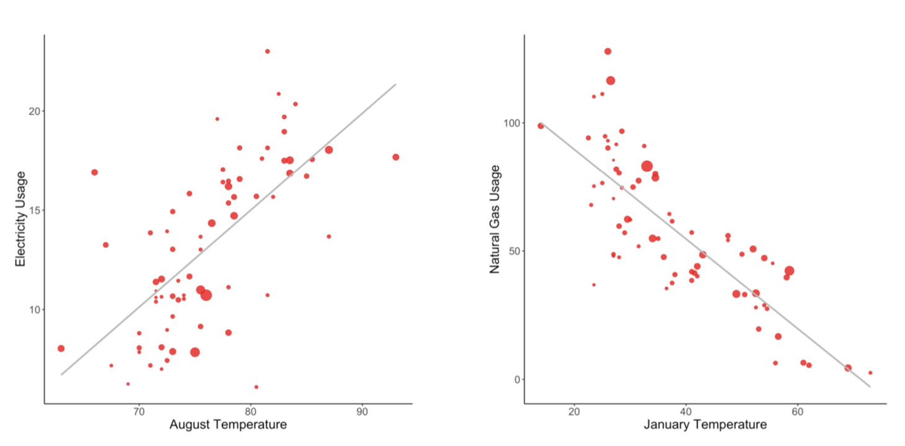
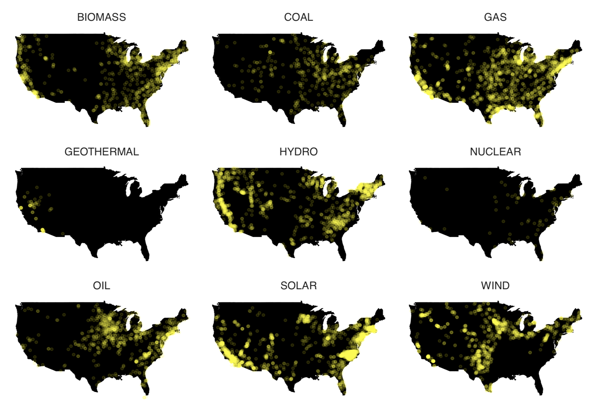
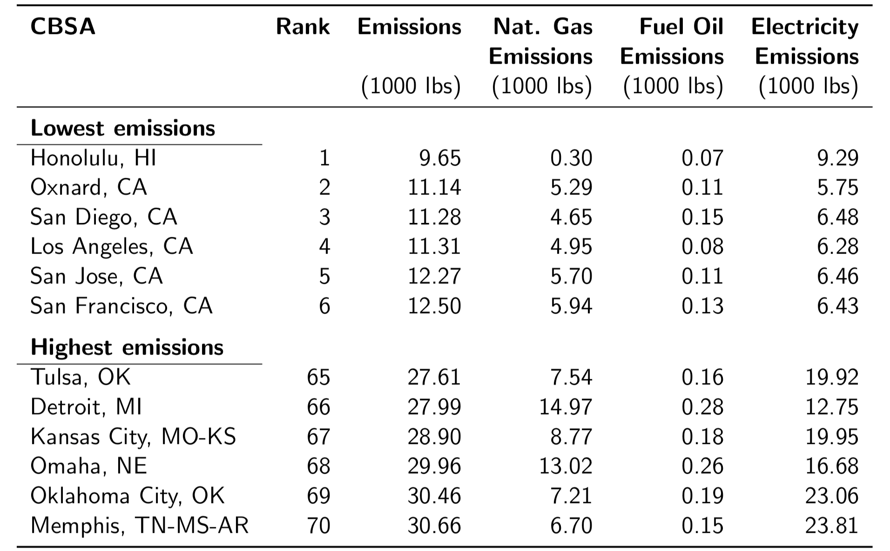
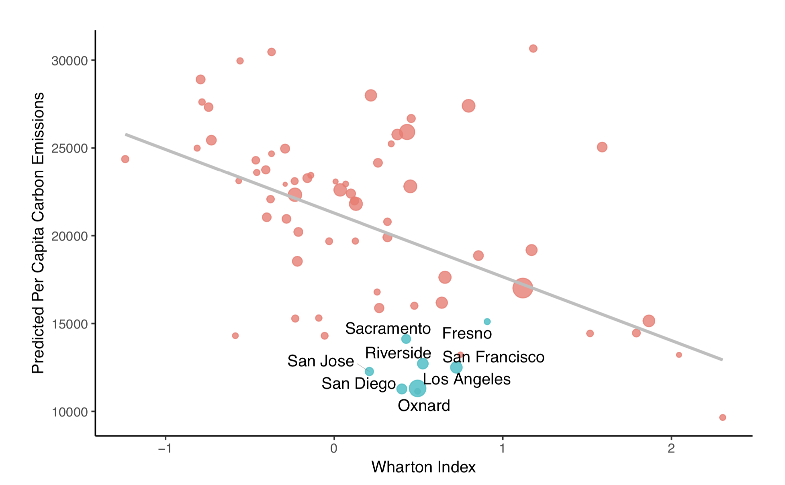
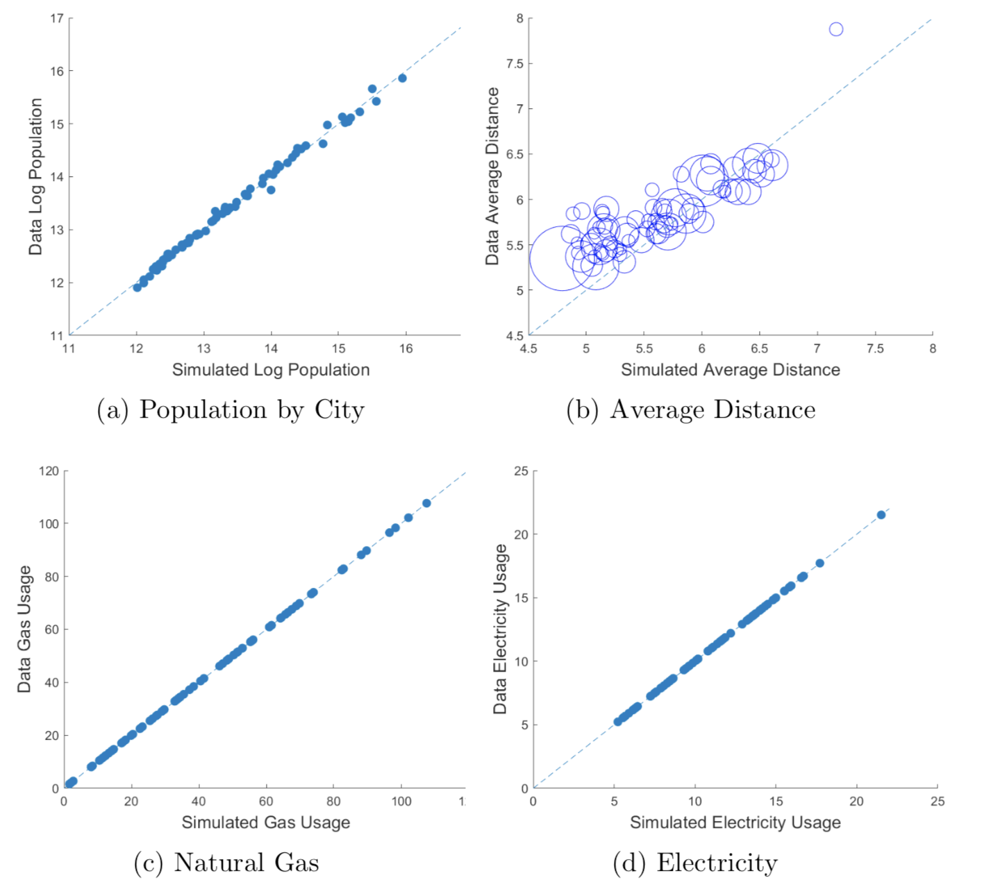
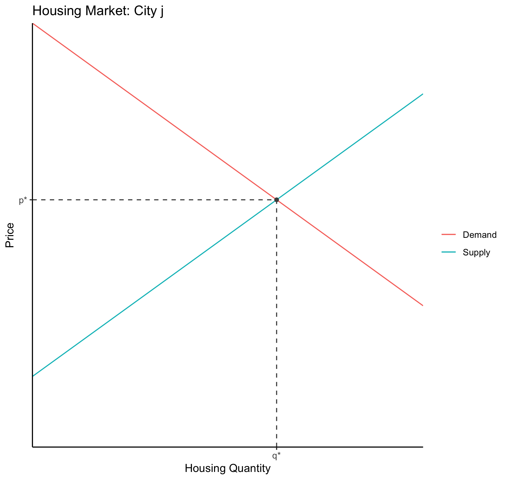
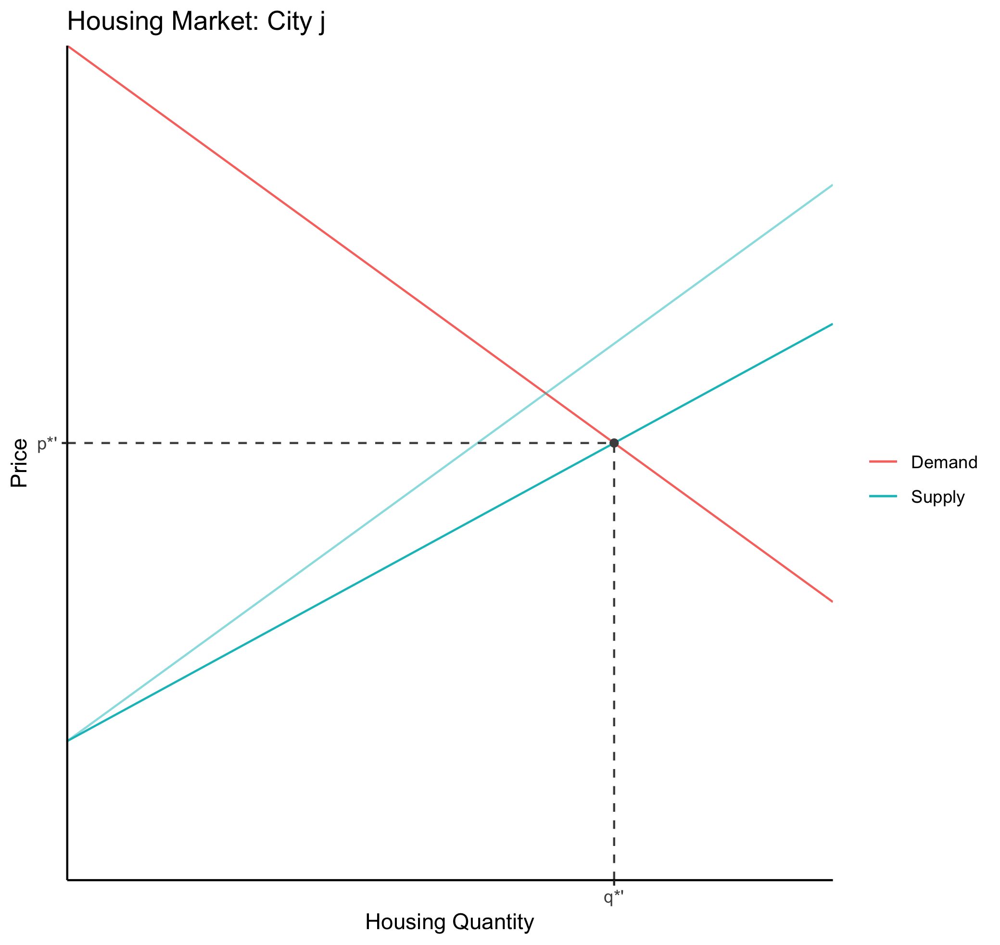
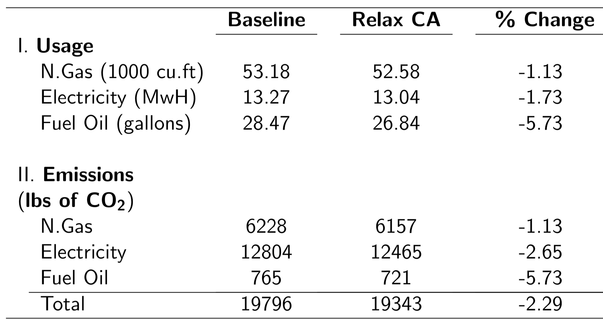

class: inverse, center, middle

```{R, setup, include = F}
options(htmltools.dir.version = FALSE)
library(pacman)
p_load(
  broom, here, tidyverse,
  latex2exp, ggplot2, ggthemes, viridis, extrafont, gridExtra,
  kableExtra,
  dplyr, magrittr, knitr, parallel, tufte,emo
)
# Define pink color
red_pink <- "#e64173"
turquoise <- "#20B2AA"
grey_light <- "grey70"
grey_mid <- "grey50"
grey_dark <- "grey20"
# Dark slate grey: #314f4f
# Knitr options
opts_chunk$set(
  comment = "#>",
  fig.align = "center",
  fig.height = 7,
  fig.width = 10.5,
  warning = F,
  message = F
)
opts_chunk$set(dev = "svg")
options(device = function(file, width, height) {
  svg(tempfile(), width = width, height = height)
})

```


# Lecture 18: Urban Sorting & The Environment

---


name: schedule
# Schedule

## Today

--

1) .hi.purple[Household Sorting, Land-use Restrictions, and Carbon Emissions]

  - Walk through of [Colas & Morehouse (2020)](https://drive.google.com/file/d/1-Cn6OiwNJeWksrKi7WG-58th77odfNm4/view)

--

--

## Upcoming

  - .hi.slate[Final]
  
--

---


# Intro

Household emit carbon for many reasons. 


---


count: false

# Intro

Household emit carbon for many reasons. 

1) Use of appliances. Main Culprits:

  - Air conditioning (electricity)
  
  - Heating (natural gas)
  

---


count: false

# Intro

Household emit carbon for many reasons. 

1) Use of appliances. Main Culprits:

  - Air conditioning (electricity)
  
  - Heating (natural gas)
  
2) Driving


---


count: false

# Intro

Household emit carbon for many reasons. 

1) Use of appliances. Main Culprits:

  - Air conditioning (electricity)
  
  - Heating (natural gas)
  
2) Driving

We will focus on 1). The amount of electricity and natural gas a household consumes varies considerably across cities

---


# Energy Use and Climate

```{R, tmp, out.width = "90%", out.height = "90%", echo = F}

```

---


# Carbon Emissions

Utilization of energy (natural gas, electricity) leads to carbon emissions

---


count: false
# Carbon Emissions

Utilization of energy (natural gas, electricity) leads to carbon emissions

  - Natural gas directly emits carbon (so the emissions factor is independent of location)
  
  - Electricity needs to be produced at a power plant. 
    
 
---


count: false
# Carbon Emissions

Utilization of energy (natural gas, electricity) leads to carbon emissions

  - Natural gas directly emits carbon (so the emissions factor is independent of location)
  
  - Electricity needs to be produced at a power plant. 
    
    - Power plants use different fuels 
    
    - Different fuels $\implies$ different emissions factors for electricity use across locations
  

---


count: false
# Carbon Emissions

Utilization of energy (natural gas, electricity) leads to carbon emissions

  - Natural gas directly emits carbon (so the emissions factor is independent of location)
  
  - Electricity needs to be produced at a power plant. 
    
    - Power plants use different fuels 
    
    - Different fuels $\implies$ different emissions factors for electricity use across locations
  
Example of clean energy? Dirty Energy?

---

# Plant Types
```{R, plant_types, out.width = "90%", out.height = "90%", echo = F}

```


---

# So Far

Household carbon emissions vary by location due to


---


count: false
# So Far

Household carbon emissions vary by location due to

1. Temperature Differences


---


count: false
# So Far

Household carbon emissions vary by location due to

1. Temperature Differences

2. Variation in carbon intensity of local power plants


---


count: false
# So Far

Household carbon emissions vary by location due to

1. Temperature Differences

2. Variation in carbon intensity of local power plants

.qa[Question]: A representative household in San Diego is responsible for 11.2 thousands pounds of carbon emissions per year from electricity and natural gas usage. How much is the same family in Memphis responsible for?


---

# Data

```{R, data, out.width = "90%", out.height = "90%", echo = F}

```
---


# Land-Use Restrictions

Cities also vary in the amount of land use restrictions they have. In some cities, land use restrictions are tight, meaning lots of costs and restrictions from building more housing.

  - Measured by the [Wharton Land Use Regulation Index](http://realestate.wharton.upenn.edu/working-papers/a-new-measure-of-the-local-regulatory-environment-for-housing-markets-the-wharton-residential-land-use-regulatory-index/)

---

# Policy and Emissions

```{R, wharton, out.width = "90%", out.height = "90%", echo = F}

```

---


# Recap

__So Far__

- Cities vary drastically in terms of average Household carbon emissions
  

---


count: false
# Recap

__So Far__

- Cities vary drastically in terms of average Household carbon emissions
  
  - This variation stems from:

    - Differing carbon intensities of local power plants
    - Spatial variation in the _marginal benefit_ of energy consumption
    

---


count: false
# Recap

__So Far__

- Cities vary drastically in terms of average Household carbon emissions
  
  - This variation stems from:

    - Differing carbon intensities of local power plants
    - Spatial variation in the _marginal benefit_ of energy consumption
    
- Cities with lower per capita carbon emissions have stricter land-use regs (on average)

---


count: false
# Recap

__So Far__

- Cities vary drastically in terms of average Household carbon emissions
  
  - This variation stems from:

    - Differing carbon intensities of local power plants
    - Spatial variation in the _marginal benefit_ of energy consumption
    
- Cities with lower per capita carbon emissions have stricter land-use regs (on average)

__Up Next__
  
- Develop a quantative model to estimate the impact of land-use restrictions on national carbon emissions. Specifically, relax land-use regulations in CA to a "reasonable" level

---


# Model: Overview

1) __Locations__ vary by

---


count: false
# Model: Overview

1) __Locations__ vary by
  - Wages, rents, energy prices, and amenities
  - Carbon Intensity of regional power plants

---


count: false
# Model: Overview

1) __Locations__ vary by
  - Wages, rents, energy prices, and amenities
  - Carbon Intensity of regional power plants
  - Marginal benefit of energy use for different energy types
  

---


count: false
# Model: Overview

1) __Locations__ vary by
  - Wages, rents, energy prices, and amenities
  - Carbon Intensity of regional power plants
  - Marginal benefit of energy use for different energy types
  
2) __Households__ 
  - Demand a composite consumption good, housing, and energy
  - Decide where to live (and thus work)

---


count: false
# Model: Overview

1) __Locations__ vary by
  - Wages, rents, energy prices, and amenities
  - Carbon Intensity of regional power plants
  - Marginal benefit of energy use for different energy types
  
2) __Households__ 
  - Demand a composite consumption good, housing, and energy
  - Decide where to live (and thus work)
  - Vary by demographic, birth locations, and an unobservable component (to the researchers) to location preferences


---


count: false
# Model: Overview

1) __Locations__ vary by
  - Wages, rents, energy prices, and amenities
  - Carbon Intensity of regional power plants
  - Marginal benefit of energy use for different energy types
  
2) __Households__ 
  - Demand a composite consumption good, housing, and energy
  - Decide where to live (and thus work)
  - Vary by demographic, birth locations, and an unobservable component (to the researchers) to location preferences

3) __Emissions__
  - Use of energy leads to carbon emissions
  - Emissions factors for electricity use vary by location

---


count: false
# Model: Overview

1) __Locations__ vary by
  - Wages, rents, energy prices, and amenities
  - Carbon Intensity of regional power plants
  - Marginal benefit of energy use for different energy types
  
2) __Households__ 
  - Demand a composite consumption good, housing, and energy
  - Decide where to live (and thus work)
  - Vary by demographic, birth locations, and an unobservable component (to the researchers) to location preferences

3) __Emissions__
  - Use of energy leads to carbon emissions
  - Emissions factors for electricity use vary by location

---


# Simplified Model

 Suppose we have two locations. Utility in location $j$ is given by: 

\begin{align*}
U(w_j, R_j, P^{elec}_j) =  w_j - \frac{1}{2}* R_j - \frac{1}{10}P^{elec}_j
\end{align*}

---


count: false
# Simplified Model

 Suppose we have two locations. Utility in location $j$ is given by: 

\begin{align*}
U(w_j, R_j, P^{elec}_j) =  w_j - \frac{1}{2}* R_j - \frac{1}{10}P^{elec}_j
\end{align*}

- Rents in each city are given by $R_j = (1+k_j)*L_j$ where:


---


count: false
# Simplified Model

 Suppose we have two locations. Utility in location $j$ is given by: 

\begin{align*}
U(w_j, R_j, P^{elec}_j) =  w_j - \frac{1}{2}* R_j - \frac{1}{10}P^{elec}_j
\end{align*}

- Rents in each city are given by $R_j = (1+k_j)*L_j$ where:

  - $k_j$ is the level of land-use restrictions in location $j$
  - $L_j$ is the population of location $j$


---


count: false
# Simplified Model

 Suppose we have two locations. Utility in location $j$ is given by: 

\begin{align*}
U(w_j, R_j, P^{elec}_j) =  w_j - \frac{1}{2}* R_j - \frac{1}{10}P^{elec}_j
\end{align*}

- Rents in each city are given by $R_j = (1+k_j)*L_j$ where:

  - $k_j$ is the level of land-use restrictions in location $j$
  - $L_j$ is the population of location $j$


---


count: false
# Simplified Model

 Suppose we have two locations. Utility in location $j$ is given by: 

\begin{align*}
U(w_j, R_j, P^{elec}_j) =  w_j + \frac{1}{2}* R_j + \frac{1}{10}P^{elec}_j
\end{align*}

- Rents in each city are given by $R_j = (1+k_j)*L_j$ where:

  - $k_j$ is the level of land-use restrictions in location $j$
  - $L_j$ is the population of location $j$


---


count: false
# Simplified Model

 Suppose we have two locations. Utility in location $j$ is given by: 

\begin{align*}
U(w_j, R_j, P^{elec}_j) =  w_j - \frac{1}{2}* R_j - \frac{1}{10}P^{elec}_j
\end{align*}

- Rents in each city are given by $R_j = (1+k_j)*L_j$ where:

  - $k_j$ is the level of land-use restrictions in location $j$
  - $L_j$ is the population of location $j$


- Carbon emissions in location 1: $10$ per 1 unit of electricity
- Carbon emissions in location 2: $5$ per 1 unit of electricity 

  - Denote carbon emissions per unit in city j as $\delta_j$
  
  
---


# Example

Suppose $k_1 = 2$, $k_2 =  4$. Also suppose $P^{elec}_1 = 10$ and $P^{elec}_2 = 10$. 

- Assume $w_1 = 200, w_2 = 205$ and total population is fixed at 1000.

.qa[Q1]: Compute equilibrium population levels in each city


---

# Example


---


# Example

Furthermore, let $e^*_j$ be the households optimal consumption of electicity in location $j$. This is given by:

\begin{align*}
e^*_j = \frac{\frac{1}{10}*w_j}{P^{elec}_j}
\end{align*}


.qa[Q2]: Compute emissions in each city and total emissions. Hint: Emissions in each city is given by:
\begin{align*}
Emis_j = \delta_j* e^*_j*L^*_j
\end{align*}


---

# Example

Recompute total emissions when $k_2 = 2$. 

---

# Example


---


# Example


---

# Model Fit

- Mark and I estimate the model on publicly available data

  - This part is the hard part, so I won't go into detail
  

---

count: false
# Model Fit

- Mark and I estimate the model on publicly available data

  - This part is the hard part, so I won't go into detail
  
- Can check how well model fits the data by solving the equilibrium in the model and compare the models outputs to the data.

---

# Model Fit

```{R, mfit, out.width = "80%", out.height = "80%", echo = F}

```

---

# Counterfactual

- We estimate the model on publicly available data. Then:

__Main Counterfactual__: Relax land-use regulation in CA to match the national median


---


count: false
# Counterfactual

- We estimate the model on publicly available data. Then:

__Main Counterfactual__: Relax land-use regulation in CA to match the national median

__Mechanism__:


---


count: false
# Counterfactual

- We estimate the model on publicly available data. Then:

__Main Counterfactual__: Relax land-use regulation in CA to match the national median

__Mechanism__:

  - Mechanically, relaxing land-use regs decrease rents in CA
  - Households move to CA due to cheaper rents


---


count: false
# Counterfactual

- We estimate the model on publicly available data. Then:

__Main Counterfactual__: Relax land-use regulation in CA to match the national median

__Mechanism__:

  - Mechanically, relaxing land-use regs decrease rents in CA
  - Households move to CA due to cheaper rents
  - Economy reaches a new equilibrium in rents, wages, and location choices
  


---


count: false
# Counterfactual

- We estimate the model on publicly available data. Then:

__Main Counterfactual__: Relax land-use regulation in CA to match the national median

__Mechanism__:

  - Mechanically, relaxing land-use regs decrease rents in CA
  - Households move to CA due to cheaper rents
  - Economy reaches a new equilibrium in rents, wages, and location choices
  
__Carbon Emissions__:

  - .hi[CA]: low marginal benefit of energy use (temperate climate)
  - Carbon efficient power plants 
  - Thus, should expect equilibrium emissions to fall as a result
  

---


# Graph
.pull-left[
```{R, 201, out.width = "90%", out.height = "90%", echo = F}

```
]


---


count: false
# Graph
.pull-left[
```{R, 2012a, out.width = "90%", out.height = "90%", echo = F}

```
]

.pull-right[
```{R, 2012, out.width = "90%", out.height = "90%", echo = F}

```
]
---


# SB501

.pull-left[
```{R, sort2, out.width = "90%", out.height = "90%", echo = F}

```
]
.pull-right[
```{R, sort1, out.width = "90%", out.height = "90%", echo = F}

```
]
---


# Results

```{R, sort3, out.width = "90%", out.height = "90%", echo = F}

```

---


# Conclusion

## Takeaways

- Land-use policies that change where workers live have important implications for national carbon emissions


---


count: false
# Conclusion

## Takeaways

- Land-use policies that change where workers live have important implications for national carbon emissions
- Estimated the impact of relaxed land-use regulations in CA

  - Predicted national household carbon emissions fall by 2.29% 


---


exclude: true

```{r decktape}
pagedown::chrome_print(here::here("018-env_sorting","lecture_18.html"))
```


<!-- --- -->
<!-- exclude: true -->

<!-- ```{R, generate pdfs, include = F} -->
<!-- system("decktape remark 02_goodsmarket_part1.html 02_goodsmarket_part1.pdf --chrome-arg=--allow-file-access-from-files") -->
<!-- ``` -->


